# 마크인포 문제 해결형 OKR 시스템 MVP API 명세서

| 항목 | 내용 |
| --- | --- |
| 문서 상태 | MVP 논리 API 계약 |
| Base URL | `https://okr.<private-network>/api/v1` |
| 인증 전제 | 사내망 또는 승인된 Tailscale private network, 활성 앱 계정, HTTPS 세션 |
| 기본 형식 | JSON UTF-8, ISO 8601 날짜·시각, UUID 식별자 |
| 기준 문서 | [PRD](./PRD.md), [기능명세서](./기능명세서.md), [화면흐름도](./화면흐름도.md), [ERD](./erd.md), [권한정책](./권한정책.md), [기존 MVP 기획서](./local-okr-mvp-design.md) |

이 문서는 화면의 버튼 목록이 아니라 서버가 실제로 보장해야 하는 API 계약이다. 모든 엔드포인트는 [권한정책](./권한정책.md)의 네트워크·계정·전역 역할·리소스 범위·참여자 관계·상태를 순서대로 판정한다. 이미지 와이어프레임은 이 API가 제공하는 화면별 데이터 묶음(홈, 문제, 목표, 체크인, 보고, 회의, 마감, 관리자)의 소비자다.

## 1. 공통 규약

### 1.1 인증·권한·버전

| 항목 | 규약 |
| --- | --- |
| 네트워크 관문 | reverse proxy가 private network·IdP MFA 정책을 통과한 HTTPS 요청만 앱에 전달한다. 공개 인터넷, 포트 포워딩, Tailscale Funnel은 사용하지 않는다. |
| 앱 세션 | `POST /auth/login`은 활성 앱 계정에만 세션 쿠키를 발급한다. 세션은 유휴 30분 또는 최대 8시간 후 만료하며, 계정·역할·팀 변경은 다음 요청부터 반영한다. |
| 권한 판정 | 서버는 매 요청에서 `active`, `app_role`, `primary_team_id`, 리소스 `visibility`, 소유 팀, 최종 책임자, `OKR_PARTICIPANT`, 상태를 확인한다. 프런트엔드의 버튼 숨김은 보안 수단이 아니다. |
| API 버전 | MVP는 `/api/v1`만 사용한다. 호환성을 깨는 변경은 `/api/v2`로 분리한다. |
| 동시 수정 | 수정 가능한 리소스는 응답의 `version` 또는 `updated_at`을 함께 반환한다. 변경 요청은 `If-Match` 또는 본문의 `version`을 보내며 충돌 시 `409`를 반환한다. |
| 외부 전송 | Slack 전송은 `Idempotency-Key`와 미리보기 확인 토큰을 함께 요구한다. 자동 재시도·예약 전송은 없다. |

### 1.2 응답 형식

성공 응답은 필요한 경우 `data`, 목록은 `meta`를 포함한다.

```json
{
  "data": {
    "id": "7e5d7a69-5f66-4b5f-8c7c-58f2a1c904ef"
  },
  "meta": {
    "next_cursor": null
  }
}
```

오류는 아래 형식으로 통일한다. 접근할 수 없는 리소스는 존재 여부를 노출하지 않기 위해 `404`를 반환한다.

```json
{
  "error": {
    "code": "STATE_TRANSITION_INVALID",
    "message": "Active 상태의 목표만 체크인을 작성할 수 있습니다.",
    "request_id": "req_01J...",
    "details": [
      { "field": "target_id", "reason": "OBJECTIVE_NOT_ACTIVE" }
    ]
  }
}
```

| HTTP | 대표 코드 | 의미 |
| --- | --- | --- |
| `200` | — | 조회·수정·상태 전환 성공 |
| `201` | — | 새 리소스·이력·전송 기록 생성 성공 |
| `204` | — | 참여자 해제 등 본문 없는 성공 |
| `400` | `VALIDATION_XOR_TARGET` | 다형 대상 중 정확히 하나를 지정하지 않았거나 형식이 잘못됨 |
| `401` | `AUTH_SESSION_INVALID` | 로그인되지 않았거나 세션이 만료됨 |
| `403` | `ROLE_FORBIDDEN`, `NETWORK_DENIED` | 역할상 허용되지 않은 운영 행위 또는 private network 거부 |
| `404` | `RESOURCE_NOT_FOUND` | 존재하지 않거나 열람 범위 밖의 리소스 |
| `409` | `VERSION_CONFLICT`, `STATE_TRANSITION_INVALID`, `CONFLICT_ALREADY_SENT`, `CONFLICT_CLOSED_READ_ONLY` | 이력·상태·중복 전송·동시성 규칙 위반 |
| `422` | `PERSONAL_OKR_DISABLED`, `PROBLEM_NOT_ACCEPTED`, `CARRY_SUCCESSOR_REQUIRED` | 형식은 맞지만 업무 규칙을 만족하지 못함 |
| `502` | `SLACK_DELIVERY_FAILED`, `GOOGLE_SNAPSHOT_FAILED` | 외부 연동 실패. 실패 이력은 보존됨 |

### 1.3 공통 값과 접근 범위

| 필드 | 허용 값 |
| --- | --- |
| `visibility` | `organization`, `owner_team`, `participants_only` |
| `objective.state` / `cycle.status` | `draft`, `alignment`, `active`, `closeout`, `closed` |
| `participant.role` | `contributor`, `reviewer`, `observer` |
| `check_in.health` | `on_track`, `at_risk`, `off_track` |
| `problem.decision_status` | `accepted`, `deferred`, `rejected`, `duplicate` |
| `carry_forward.decision` | `stop`, `continue`, `rescope`, `operations` |

`target`을 받는 API는 다음 객체를 사용한다. `type`과 `id`의 조합으로 하나의 대상만 식별하며, 서버는 해당 사용자의 접근 권한을 다시 확인한다.

```json
{
  "target": {
    "type": "objective",
    "id": "uuid"
  }
}
```

## 2. API 도메인 개요

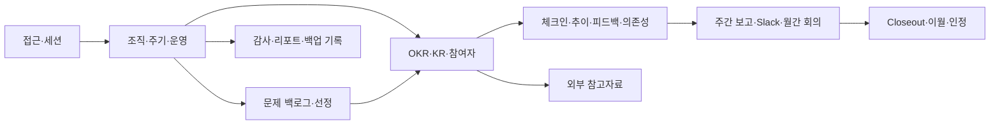

| 도메인 | 핵심 기능 명세 | 주요 리소스 |
| --- | --- | --- |
| 접근·권한 | `F-001` ~ `F-003` | 세션, 현재 사용자 |
| 조직·주기·감사 | `F-004` ~ `F-007` | 사용자, 팀, Cycle, 감사 이벤트 |
| 문제·선정 | `F-010` ~ `F-014` | Problem, Evidence, Decision, Problem-OKR link |
| 목표·참여 | `F-020` ~ `F-025` | Objective, KR, Alignment, Participant |
| 실행·협업 | `F-030` ~ `F-035` | Check-in, Feedback, Dependency, 내 협업 |
| 보고·소통 | `F-040` ~ `F-051` | Weekly report, Slack delivery, Meeting, Action item |
| 마감·인정 | `F-060` ~ `F-063` | Closeout, Carry decision, Recognition |
| 외부·운영 | `F-070` ~ `F-073` | External reference, Snapshot, Report, Backup check |

## 3. 접근·세션 API

| Method | Path | 권한 | 요청·응답 핵심 | 기능 |
| --- | --- | --- | --- | --- |
| `POST` | `/auth/login` | private network + 활성 계정 | 요청: `email`, `password`; 응답: 현재 사용자, 세션 쿠키 | F-001, F-003 |
| `POST` | `/auth/logout` | 로그인 사용자 | 현재 세션 폐기, `204` | F-003 |
| `GET` | `/auth/me` | 로그인 사용자 | 역할, 기본 팀, 허용 범위 요약, 세션 만료 시각 | F-001~003 |
| `GET` | `/dashboard/me` | 로그인 사용자 | 내 체크인, 미작성 주간 보고, 피드백, 도움 요청의 접근 가능한 집계 | F-024, F-035 |
| `GET` | `/me/work` | 로그인 사용자 | `primary_team`, `final_owner`, `participant` 관계별 목표·액션·요청 목록 | F-035, F-051 |

### 시퀀스 A. private network 로그인과 요청별 RBAC

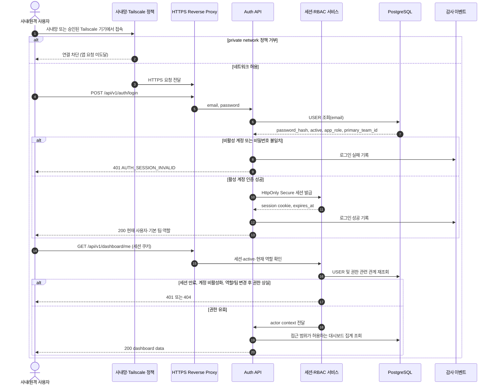

## 4. 관리자: 사용자·팀·주기·운영 API

| Method | Path | 권한 | 요청·응답 핵심 | 기능 |
| --- | --- | --- | --- | --- |
| `GET`, `POST` | `/admin/users` | 관리자 | 사용자 목록 / 이름·이메일·기본 팀·역할·활성 상태 생성 | F-004 |
| `PATCH` | `/admin/users/{userId}` | 관리자 | 역할, 기본 팀, 활성 상태 변경. 마지막 활성 관리자 강등·비활성화는 거부 | F-003, F-004 |
| `GET`, `POST` | `/admin/teams` | 관리자 | 팀 목록 / 이름·리더·개인 OKR opt-in 생성 | F-004, F-005 |
| `PATCH` | `/admin/teams/{teamId}` | 관리자 | 팀 리더, `personal_okr_enabled` 변경 | F-004, F-005 |
| `GET`, `POST` | `/admin/cycles` | 관리자 | preset 또는 custom 날짜로 주기 생성 | F-006 |
| `PATCH` | `/admin/cycles/{cycleId}` | 관리자 | 이름·날짜 수정. 상태 변경은 별도 endpoint 사용 | F-006 |
| `POST` | `/admin/cycles/{cycleId}/state-transitions` | 관리자 | `to_state`, `reason`; 허용 순서 검증·감사 | F-006, F-007 |
| `GET` | `/admin/audit-events` | 관리자 | `actor_id`, `entity_type`, `action`, 기간 cursor 필터 | F-007 |
| `GET`, `PUT` | `/admin/slack-channel` | 관리자 | 단일 승인 채널의 ID·이름·enabled 상태. 웹훅 원문은 미포함 | F-042 |
| `GET`, `POST` | `/admin/backup-checks` | 관리자 | 백업·복구 점검 기록 조회·등록. 실제 DB 백업 실행 endpoint는 제공하지 않음 | F-073 |

`POST /admin/cycles` 예시:

```json
{
  "name": "2026 하반기",
  "preset": "half_4_1_1",
  "draft_start_at": "2026-07-01",
  "alignment_start_at": "2026-07-15",
  "active_start_at": "2026-08-01",
  "closeout_start_at": "2026-12-01",
  "closed_at": "2026-12-31"
}
```

### 시퀀스 B. 팀 설정과 주기 변경의 감사 처리

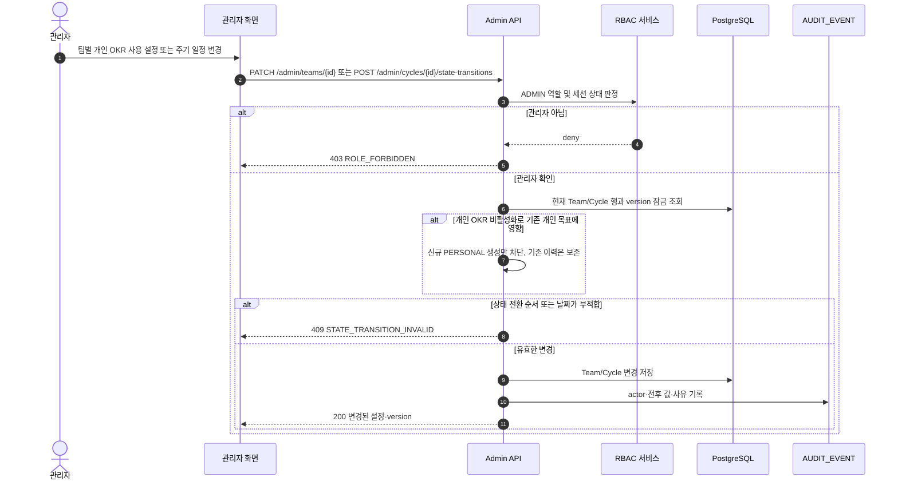

## 5. 문제 백로그·근거·선정 API

| Method | Path | 권한 | 요청·응답 핵심 | 기능 |
| --- | --- | --- | --- | --- |
| `GET` | `/problems` | 접근 가능한 사용자 | `team_id`, `cycle_id`, `status`, `priority`, `cursor` 필터. 비공개 미권한 항목은 제외 | F-012 |
| `POST` | `/problems` | 활성 사용자 | `cycle_id`, `team_id`, `description`, `proposed_idea`, `visibility`; 작성자는 서버에서 설정 | F-010 |
| `GET`, `PATCH` | `/problems/{problemId}` | 읽기 범위 / 작성자·리더·관리자 | 작성자는 Draft/Active 필수 정보만 수정 | F-010 |
| `POST` | `/problems/{problemId}/evidence` | 접근 + 쓰기 권한 | URL 또는 메모를 append-only로 추가 | F-011 |
| `POST` | `/feedback` | 대상 접근 + 댓글 권한 | `target={type:problem,id}`, `body`, `mentions[]` | F-011, F-033 |
| `POST` | `/problems/{problemId}/decisions` | 소유 팀 리더·관리자 | `status`, `rationale`, `next_review_at` 또는 `duplicate_problem_id` | F-013 |
| `POST` | `/problem-decisions/{decisionId}/okr-links` | 소유 팀 리더·관리자 | `target={type:objective|key_result,id}`, `is_representative` | F-014 |
| `POST` | `/problem-decisions/{decisionId}/objective-drafts` | 소유 팀 리더·관리자 | Accepted 결정에서만 Objective Draft 생성 후 자동 링크 | F-014, F-020 |

`POST /problems/{problemId}/decisions`의 업무 규칙:

- `deferred`에는 `next_review_at`이 필수다.
- `rejected`에는 거절 사유가 필수다.
- `duplicate`에는 대표 Problem ID가 필수다.
- `accepted` 결정만 목표 초안 생성·기존 OKR 연결을 허용한다.

### 시퀀스 C. 문제 제안부터 선정·Objective 연결까지

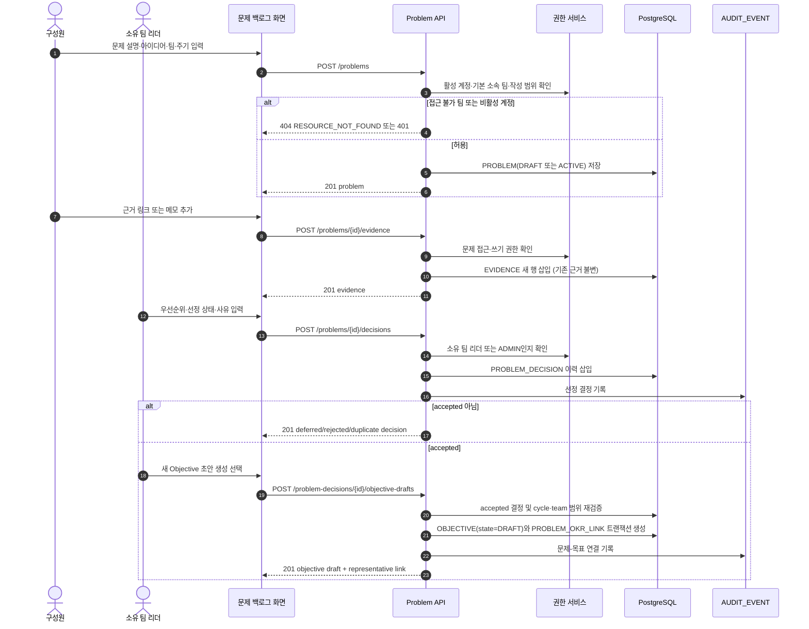

## 6. Objective·KR·정렬·참여자 API

| Method | Path | 권한 | 요청·응답 핵심 | 기능 |
| --- | --- | --- | --- | --- |
| `GET` | `/objectives` | 접근 가능한 사용자 | `cycle_id`, `team_id`, `state`, `owner_id`, `kind` 필터. 보드용 계층·진행률 포함 | F-024 |
| `POST` | `/objectives` | 회사: 관리자 / 팀: 구성원·리더 / 개인: 본인·리더·관리자 | 제목, 소유 팀, 단일 책임자, 기간, kind, visibility, 문제 가설 | F-020 |
| `GET`, `PATCH` | `/objectives/{objectiveId}` | 읽기 범위 / Draft 편집자 또는 리더·관리자 | Active 구조 변경에는 `reason` 필수 | F-020, F-024 |
| `POST` | `/objectives/{objectiveId}/key-results` | Draft 편집자·리더·관리자 | KR 측정 단위·시작/목표값·책임자·기간 | F-021 |
| `PATCH` | `/key-results/{keyResultId}` | 책임자·리더·관리자 | 구조 변경과 책임자 변경 규칙 검증 | F-021 |
| `POST` | `/objectives/{objectiveId}/alignments` | 소유 팀 리더·관리자 | `target={objective|key_result}`, `rationale` | F-022 |
| `POST` | `/objectives/{objectiveId}/state-transitions` | 소유 팀 리더·관리자 | `to_state`, `reason`, `version` | F-023 |
| `GET`, `POST` | `/okr-targets/{type}/{id}/participants` | 읽기 범위 / 생성자·책임자·리더·관리자 | `user_id`, `role`, `permissions` | F-025 |
| `DELETE` | `/okr-targets/{type}/{id}/participants/{participantId}` | 생성자·책임자·리더·관리자 | Active 이후 해제 사유 필수 | F-025 |

`POST /objectives` 예시:

```json
{
  "cycle_id": "uuid",
  "owner_team_id": "uuid",
  "owner_user_id": "uuid",
  "kind": "team",
  "title": "신규 사용자가 핵심 가치를 빠르게 경험한다",
  "description": "온보딩 이탈 문제를 해결한다.",
  "visibility": "organization",
  "start_at": "2026-08-01",
  "end_at": "2026-11-30",
  "problem_decision_id": "uuid"
}
```

### 시퀀스 D. Draft 작성·Alignment 확정·참여자 초대

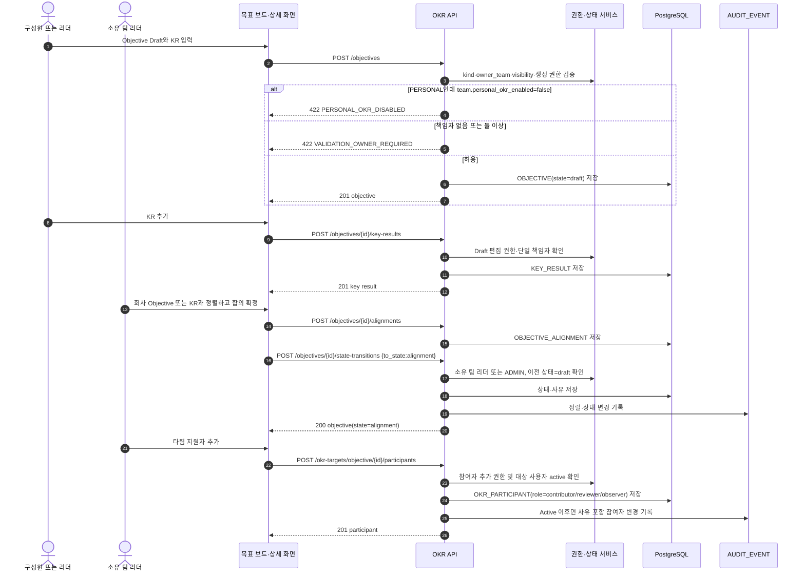

## 7. 체크인·추이·피드백·의존성 API

| Method | Path | 권한 | 요청·응답 핵심 | 기능 |
| --- | --- | --- | --- | --- |
| `POST` | `/okr-targets/{type}/{id}/check-ins` | 최종 책임자 또는 배정 `contributor` | 현재값, 건강 상태, 성과, 이슈, 다음 행동, 관측일 | F-030 |
| `GET` | `/okr-targets/{type}/{id}/check-ins` | 대상 열람자 | 날짜순 append-only 이력, 정정 관계 | F-031 |
| `POST` | `/check-ins/{checkInId}/corrections` | 원 작성자 또는 관리자 | 새 값·메모·원본 참조. 관리자는 `reason` 필수 | F-031 |
| `GET` | `/okr-targets/{type}/{id}/trend` | 대상 열람자 | 실제 값, 기간 기준 기대값, 정정 관계 | F-032 |
| `POST` | `/feedback` | 대상 접근 + 댓글 권한 | `target`, `body`, `mentions[]` | F-033 |
| `GET` | `/feedback` | 대상 열람자 | `target_type`, `target_id`, cursor | F-033 |
| `POST` | `/okr-dependencies` | 책임자·contributor·리더·관리자 | 출발/대상 OKR, 담당자, 기한, 요청 내용 | F-034 |
| `PATCH` | `/okr-dependencies/{dependencyId}` | 요청·대상 담당자, 리더, 관리자 | 상태·사유·기한 변경 | F-034 |

### 시퀀스 E. 체크인 작성·정정·추이 조회

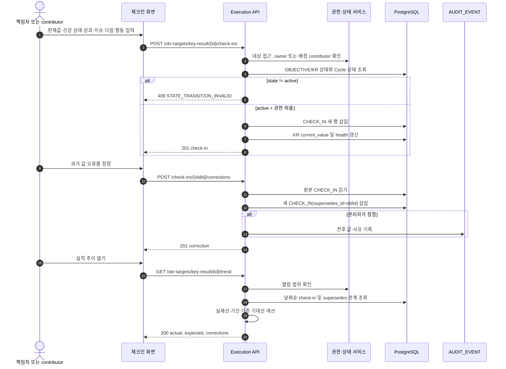

### 시퀀스 F. 피드백과 타팀 도움 요청

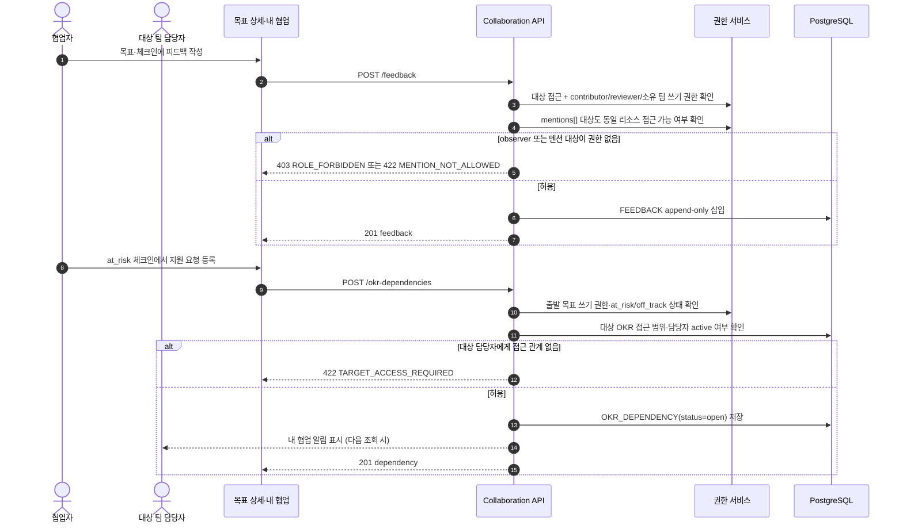

## 8. 주간 보고·Slack API

| Method | Path | 권한 | 요청·응답 핵심 | 기능 |
| --- | --- | --- | --- | --- |
| `GET`, `POST` | `/weekly-reports` | 접근 범위 / 작성자·리더·관리자 | 팀·주기·주차·관련 OKR, 성과·계획·위험으로 draft 작성 | F-040 |
| `GET`, `PATCH` | `/weekly-reports/{reportId}` | 열람 범위 / 작성자·리더·관리자 | 버전 보존. 전송한 버전은 수정 시 새 버전 생성 | F-040 |
| `POST` | `/weekly-reports/{reportId}/slack-previews` | 작성자·리더·관리자 | 현재 버전·승인 채널·본문·링크·`confirmation_token` 반환 | F-041 |
| `POST` | `/weekly-reports/{reportId}/slack-deliveries` | 해당 보고 작성자 | `report_version`, `confirmation_token`, `Idempotency-Key`로 명시 전송 | F-042, F-043 |
| `GET` | `/weekly-reports/{reportId}/slack-deliveries` | 리포트 열람 범위 | 전송 성공·실패·메시지 ID·시각·원인 | F-043 |

`POST /weekly-reports/{reportId}/slack-deliveries` 요청:

```json
{
  "report_version": 3,
  "confirmation_token": "one-time-preview-token"
}
```

요청 헤더:

```text
Idempotency-Key: 4be73bf0-85ea-4af4-9f62-7a6ce74daa19
```

### 시퀀스 G. Slack 미리보기·명시 전송·실패 수동 재시도

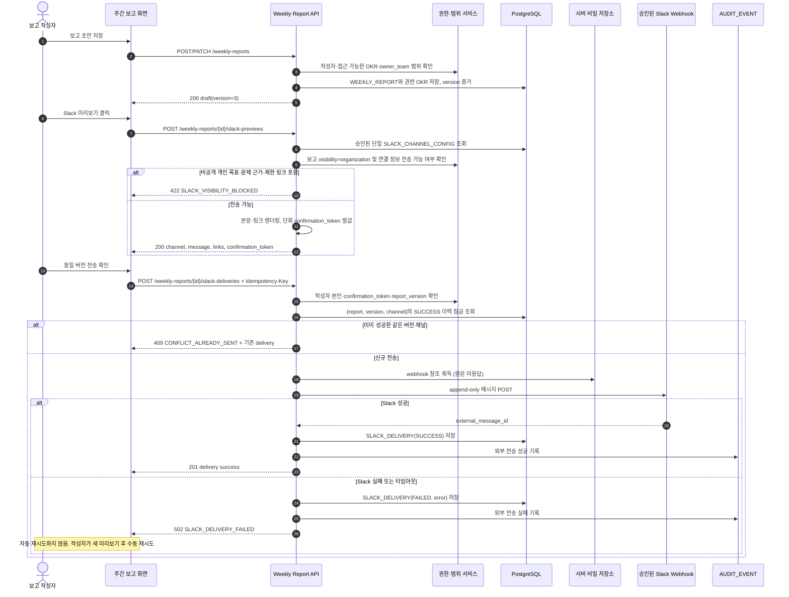

## 9. 월간 회의·액션 아이템 API

| Method | Path | 권한 | 요청·응답 핵심 | 기능 |
| --- | --- | --- | --- | --- |
| `GET`, `POST` | `/meeting-notes` | 접근 범위 / 소유 팀 구성원·리더·관리자 | 주기·팀·일시·참석자·안건·논의·결정·위험·학습 | F-050 |
| `GET`, `PATCH` | `/meeting-notes/{meetingId}` | 열람 범위 / 작성자·리더·관리자 | 확정은 팀 리더·관리자만. 연결 범위 중 가장 좁은 visibility 적용 | F-050 |
| `POST` | `/meeting-notes/{meetingId}/links` | 회의록 편집자 | Problem·Objective·KR·Weekly report 중 정확히 하나 연결 | F-050 |
| `GET`, `POST` | `/meeting-notes/{meetingId}/action-items` | 회의록 편집자 | 담당자·기한·상태·결과물 링크·OKR 연결 | F-051 |
| `PATCH` | `/action-items/{actionItemId}` | 담당자·소유 팀 리더·관리자 | 담당자는 자신의 상태·결과물만 변경 | F-051 |

### 시퀀스 H. 월간 회의 확정과 액션 아이템 배정

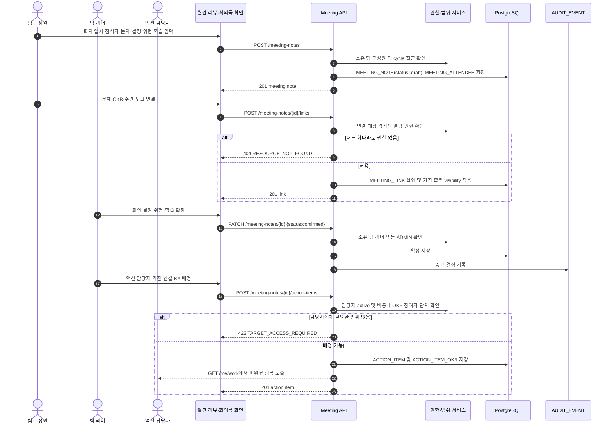

## 10. Closeout·이월·인정 API

| Method | Path | 권한 | 요청·응답 핵심 | 기능 |
| --- | --- | --- | --- | --- |
| `GET` | `/closeouts` | 대상 열람 범위 | cycle·team·상태 필터, 최종 결과·이월 상태 | F-060~062 |
| `POST` | `/closeouts` | 최종 책임자 제안, 리더·관리자 확정 | 대상 Objective/KR, 최종값, 문제 결과, 학습 | F-060 |
| `POST` | `/closeouts/{closeoutId}/carry-forward-decisions` | 소유 팀 리더·관리자 | 결정·사유·후속 목표 또는 상시업무 기록 | F-061 |
| `POST` | `/objectives/{objectiveId}/state-transitions` | 소유 팀 리더·관리자 | `to_state=closed`, closeout·carry 결정 완료 검증 | F-023, F-062 |
| `GET`, `POST` | `/recognition-nominations` | 열람 범위 / 소유 팀 리더·관리자 | cycle, 후보 사용자/팀, 카테고리, 근거 | F-063 |

### 시퀀스 I. Closeout 확정·명시적 이월·Closed 읽기 전용

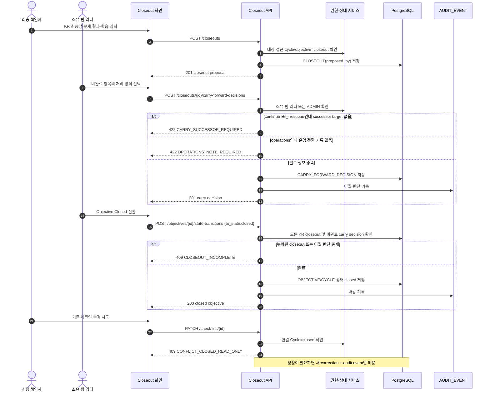

## 11. 외부 참고자료·기본 리포트·감사·백업 API

| Method | Path | 권한 | 요청·응답 핵심 | 기능 |
| --- | --- | --- | --- | --- |
| `GET`, `POST` | `/external-references` | 연결 대상 편집자 | Problem·Objective·KR·Meeting 중 정확히 하나, type, URL/ID, Sheet 범위 | F-070 |
| `GET` | `/external-references/{referenceId}` | 연결 대상 열람자 | 외부 접근 상태, 스냅샷 메타데이터. 원본 데이터·권한은 노출하지 않음 | F-070 |
| `POST` | `/admin/google-sheet-snapshots` | 관리자 | `external_reference_id`, `sheet_id`, `sheet_name`, `a1_range`; 1회 read-only 가져오기 | F-071 |
| `GET` | `/reports/operations` | 관리자 전체, 팀 리더 자기 팀, 구성원 접근 범위 요약 | cycle·team 기준 체크인/보고/회의/연결/이월 지표 | F-072 |
| `GET` | `/admin/audit-events` | 관리자 | 감사 로그 cursor 조회 | F-007 |
| `GET`, `POST` | `/admin/backup-checks` | 관리자 | 백업·월간 복구 점검 운영 기록 | F-073 |

### 시퀀스 J. 외부 링크와 승인된 Google Sheets 스냅샷

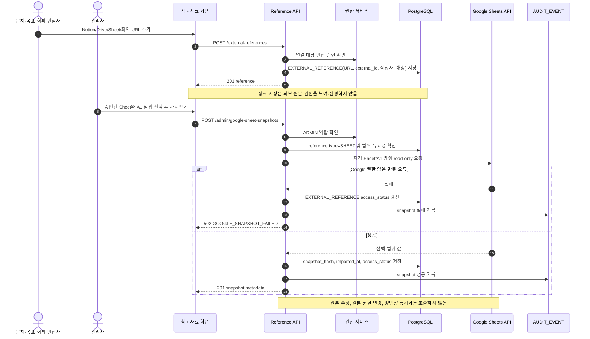

### 시퀀스 K. 운영 지표·감사 로그·백업 점검 기록

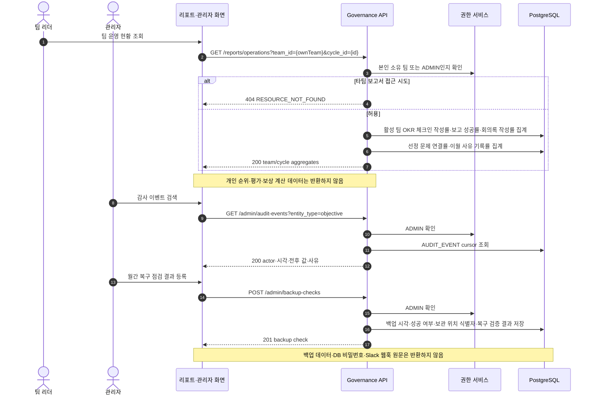

## 12. 데이터 전송 최소화와 금지 범위

| 대상 | API 정책 |
| --- | --- |
| Tailscale·IdP | 앱 API는 private network/IdP의 사용자·기기 권한을 변경하지 않는다. 운영 절차에서만 초대·철회를 확인한다. |
| Slack | 단일 승인 채널에 대한 메시지 게시만 수행한다. Slack 채널 읽기, 메시지 수정·삭제, 스레드 응답, 자동 전송·자동 재시도 API는 없다. |
| Notion·Google | 링크와 승인된 Sheet의 일회성 범위 스냅샷만 제공한다. 양방향 동기화, 원본 수정, 외부 권한 변경 API는 없다. |
| 인사·보상 | 점수·등급·보상·순위·급여·승진·자동 평가 endpoint는 MVP에 없다. |
| 비밀 값 | Slack 웹훅, DB 비밀번호, IdP secret은 모든 성공·오류 응답, 감사 이벤트, 로그에서 마스킹하거나 제외한다. |

## 13. 기능 명세 추적표

| 기능 묶음 | API 섹션 | 주요 검증 |
| --- | --- | --- |
| `F-001`~`F-003` | 3 | private network, 활성 계정, 요청별 RBAC, 세션 무효화 |
| `F-004`~`F-007` | 4 | 한 기본 팀, 팀별 개인 OKR opt-in, 유연 주기, 감사 |
| `F-010`~`F-014` | 5 | 비공개 문제 비노출, 결정 이력, accepted 후 목표 연결 |
| `F-020`~`F-025` | 6 | 단일 책임자, 정렬, 상태 전환, 참여자 분리 |
| `F-030`~`F-035` | 7 | Active 체크인, append-only 정정, 멘션·의존성 권한 |
| `F-040`~`F-043` | 8 | 미리보기, 동일 버전 확인, 단일 채널, 중복 방지·수동 재시도 |
| `F-050`~`F-051` | 9 | 회의록 연결, 액션 담당자·기한·협업 목록 |
| `F-060`~`F-063` | 10 | 결과·이월 사유·후속 링크·Closed 읽기 전용·비순위형 인정 |
| `F-070`~`F-073` | 11 | 외부 링크·Sheet snapshot, 운영 리포트, 백업·복구 기록 |

API 구현 이슈는 해당 `F-xxx`와 `AC-F-xxx-yy`를 제목·검증 항목에 함께 표기한다. 이 문서에서 정의하지 않은 외부 쓰기, 자동 전송, 평가·보상 API는 MVP 범위 밖으로 처리한다.
