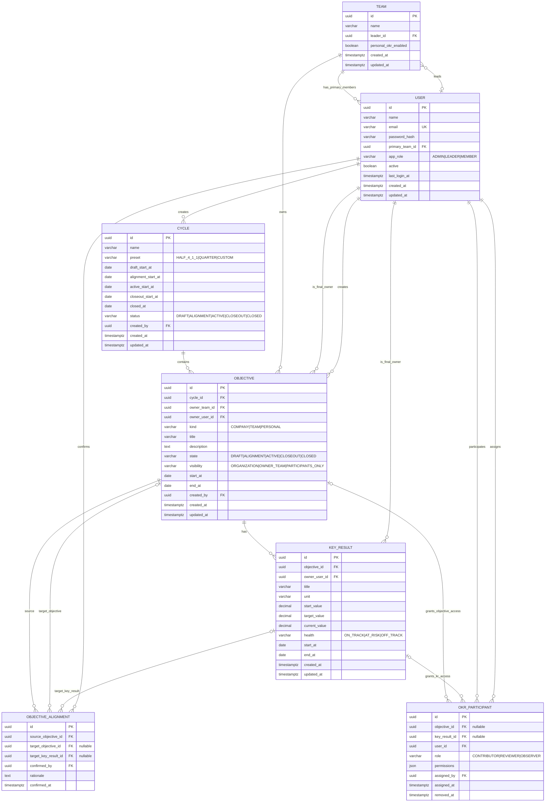
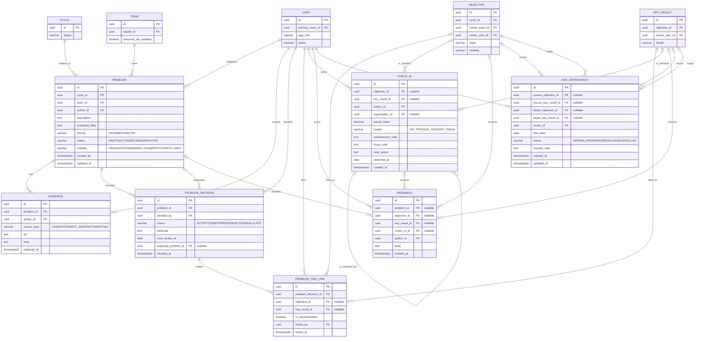

# 마크인포 문제 해결형 OKR 시스템 MVP ERD

이 문서는 [PRD](./PRD.md), [기능명세서](./기능명세서.md), [화면흐름도](./화면흐름도.md), [기존 MVP 기획서](./local-okr-mvp-design.md), [권한정책](./권한정책.md)을 기준으로 작성한 논리 데이터 모델이다.

ERD는 구현 편의상 세 영역으로 나눴다. 세 다이어그램에 반복되는 `USER`, `TEAM`, `CYCLE`, `OBJECTIVE`, `KEY_RESULT`는 같은 테이블이다.

## 1. 모델링 원칙

| 원칙 | 데이터 모델 반영 |
| --- | --- |
| 단일 기본 소속 팀 | `USER.primary_team_id`는 필수다. 타팀 협업은 `OKR_PARTICIPANT`로만 표현한다. |
| 단일 최종 책임자 | `OBJECTIVE.owner_user_id`, `KEY_RESULT.owner_user_id`는 각각 필수다. |
| 유연한 주기 | `CYCLE`은 preset과 Draft/Alignment/Active/Closeout/Closed의 날짜를 함께 보관한다. |
| 개인 OKR opt-in | `TEAM.personal_okr_enabled`가 `false`인 팀에서는 `OBJECTIVE.kind=PERSONAL`을 만들 수 없다. |
| 범위 우선 권한 | `visibility`는 `organization`, `owner_team`, `participants_only` 중 하나다. 연결 관계는 접근 범위를 자동 확장하지 않는다. |
| 이력 보존 | 체크인 정정은 `supersedes_id`로, Slack 전송은 버전별 `SLACK_DELIVERY`로, Closed 이후 정정은 새 감사 이벤트로 남긴다. |
| 외부 자료 분리 | URL·식별자·스냅샷 메타데이터만 저장한다. Notion·Google 원본 권한이나 비밀 값은 저장·변경하지 않는다. |

## 2. 조직·주기·OKR 기준 모델

### 기준 제약

- `TEAM.leader_id`는 활성 `USER`를 참조한다. 팀 리더는 팀의 기본 소속 구성원이기를 권장하지만, 역할·팀 변경은 관리자만 수행한다.
- `OBJECTIVE.kind=COMPANY`는 `visibility=ORGANIZATION`을 기본값으로 한다. `kind=PERSONAL`은 `TEAM.personal_okr_enabled=true`와 `visibility=PARTICIPANTS_ONLY`를 기본값으로 한다.
- `OBJECTIVE_ALIGNMENT`는 `target_objective_id`와 `target_key_result_id` 중 정확히 하나만 값이 있어야 한다. 동일 source-target의 중복 행은 허용하지 않는다.
- `OKR_PARTICIPANT`는 `objective_id`와 `key_result_id` 중 정확히 하나만 값이 있어야 한다. `(대상, user_id)`의 활성 참여 관계는 하나만 허용한다.
- `OBJECTIVE` 및 `KEY_RESULT`의 `state=COMMITTED` 별도 상태는 사용하지 않는다. `Alignment` 또는 그 이후 상태의 목표를 committed로 간주한다.

## 3. 문제 발견부터 목표 실행까지

### 문제·실행 제약

- `PROBLEM_DECISION`은 결정 이력이다. 최신 행이 화면의 현재 결정 상태가 되며, `ACCEPTED` 행만 `PROBLEM_OKR_LINK`를 만들 수 있다.
- `PROBLEM_OKR_LINK`는 Objective 또는 KR 중 정확히 하나를 가리킨다. 문제 하나의 활성 대표 연결(`is_representative=true`)은 최대 하나다.
- `CHECK_IN`은 Objective 또는 KR 중 정확히 하나를 대상으로 한다. `supersedes_id`는 같은 대상의 과거 체크인만 참조할 수 있으며, 원본 행을 수정하지 않는다.
- `FEEDBACK`은 Problem, Objective, KR, Check-in 중 정확히 하나를 대상으로 한다. 멘션은 별도 `FEEDBACK_MENTION` 테이블로 확장할 수 있으나 MVP에서는 본문 파싱보다 권한 검증이 우선이다.
- `OKR_DEPENDENCY`는 출발 대상과 도착 대상이 각각 Objective 또는 KR 중 정확히 하나여야 한다. 대상 담당자는 접근 권한 또는 `OKR_PARTICIPANT` 관계가 있어야 한다.
- `PROBLEM`의 근거·피드백·결정은 append-only다. 오기 수정은 새 이력 또는 관리자 정정 감사 이벤트로 처리한다.

## 4. 보고·회의·마감·외부자료·감사

```mermaid
erDiagram
    USER {
        uuid id PK
        uuid primary_team_id FK
        varchar app_role
        boolean active
    }

    TEAM {
        uuid id PK
        uuid leader_id FK
    }

    CYCLE {
        uuid id PK
        varchar status
    }

    OBJECTIVE {
        uuid id PK
        uuid cycle_id FK
        uuid owner_team_id FK
        uuid owner_user_id FK
        varchar visibility
    }

    KEY_RESULT {
        uuid id PK
        uuid objective_id FK
        uuid owner_user_id FK
    }

    PROBLEM {
        uuid id PK
        uuid cycle_id FK
        uuid team_id FK
        varchar visibility
    }

    WEEKLY_REPORT {
        uuid id PK
        uuid cycle_id FK
        uuid team_id FK
        uuid author_id FK
        date week_start_at
        integer version
        text summary
        text next_plan
        text risk_or_help
        varchar visibility
        varchar status "DRAFT|READY|SENT"
        timestamptz created_at
        timestamptz updated_at
    }

    WEEKLY_REPORT_OKR {
        uuid id PK
        uuid weekly_report_id FK
        uuid objective_id FK "nullable"
        uuid key_result_id FK "nullable"
    }

    SLACK_CHANNEL_CONFIG {
        uuid id PK
        varchar channel_id UK
        varchar channel_name
        boolean enabled
        uuid configured_by FK
        timestamptz configured_at
    }

    SLACK_DELIVERY {
        uuid id PK
        uuid weekly_report_id FK
        uuid slack_channel_config_id FK
        integer report_version
        uuid sent_by FK
        varchar external_message_id
        varchar status "SUCCESS|FAILED"
        text error_message
        timestamptz sent_at
    }

    MEETING_NOTE {
        uuid id PK
        uuid cycle_id FK
        uuid team_id FK
        uuid author_id FK
        datetime held_at
        text agenda
        text discussion
        text decisions
        text risks
        text learnings
        varchar visibility
        varchar status "DRAFT|CONFIRMED"
        timestamptz created_at
        timestamptz updated_at
    }

    MEETING_ATTENDEE {
        uuid id PK
        uuid meeting_note_id FK
        uuid user_id FK
        varchar attendance_status "INVITED|ATTENDED|ABSENT"
    }

    MEETING_LINK {
        uuid id PK
        uuid meeting_note_id FK
        uuid problem_id FK "nullable"
        uuid objective_id FK "nullable"
        uuid key_result_id FK "nullable"
        uuid weekly_report_id FK "nullable"
    }

    ACTION_ITEM {
        uuid id PK
        uuid meeting_note_id FK
        uuid owner_id FK
        date due_date
        varchar status "TODO|IN_PROGRESS|DONE|CANCELLED"
        text title
        text result_link
        timestamptz completed_at
    }

    ACTION_ITEM_OKR {
        uuid id PK
        uuid action_item_id FK
        uuid objective_id FK "nullable"
        uuid key_result_id FK "nullable"
    }

    CLOSEOUT {
        uuid id PK
        uuid cycle_id FK
        uuid objective_id FK "nullable"
        uuid key_result_id FK "nullable"
        uuid proposed_by FK
        uuid confirmed_by FK
        decimal final_value
        varchar outcome "SOLVED|IN_PROGRESS|UNSOLVABLE|REVIEW_NEXT_CYCLE"
        text learning
        timestamptz confirmed_at
    }

    CARRY_FORWARD_DECISION {
        uuid id PK
        uuid closeout_id FK
        uuid confirmed_by FK
        varchar decision "STOP|CONTINUE|RESCOPE|OPERATIONS"
        text rationale
        uuid successor_objective_id FK "nullable"
        uuid successor_key_result_id FK "nullable"
        text operations_note
        timestamptz confirmed_at
    }

    RECOGNITION_NOMINATION {
        uuid id PK
        uuid cycle_id FK
        uuid nominated_user_id FK "nullable"
        uuid nominated_team_id FK "nullable"
        uuid nominated_by FK
        varchar category "CUSTOMER_IMPACT|COLLABORATION|LEARNING|OPERATIONS"
        text evidence
        varchar review_status "DRAFT|CONFIRMED|ARCHIVED"
        timestamptz created_at
    }

    EXTERNAL_REFERENCE {
        uuid id PK
        uuid problem_id FK "nullable"
        uuid objective_id FK "nullable"
        uuid key_result_id FK "nullable"
        uuid meeting_note_id FK "nullable"
        uuid created_by FK
        varchar type "NOTION|DRIVE|SHEET|MEETING|URL"
        varchar external_id
        text url
        varchar sheet_name
        varchar a1_range
        varchar snapshot_hash
        varchar access_status "AVAILABLE|EXPIRED|DENIED|BROKEN"
        timestamptz imported_at
        timestamptz created_at
    }

    AUDIT_EVENT {
        uuid id PK
        uuid actor_id FK
        varchar entity_type
        uuid entity_id
        varchar action
        json old_value
        json new_value
        text reason
        timestamptz occurred_at
    }

    CYCLE ||--o{ WEEKLY_REPORT : includes
    TEAM ||--o{ WEEKLY_REPORT : owns
    USER ||--o{ WEEKLY_REPORT : writes
    WEEKLY_REPORT ||--o{ WEEKLY_REPORT_OKR : references
    OBJECTIVE o|--o{ WEEKLY_REPORT_OKR : references
    KEY_RESULT o|--o{ WEEKLY_REPORT_OKR : references
    USER ||--o{ SLACK_CHANNEL_CONFIG : configures
    WEEKLY_REPORT ||--o{ SLACK_DELIVERY : has_attempts
    SLACK_CHANNEL_CONFIG ||--o{ SLACK_DELIVERY : receives
    USER ||--o{ SLACK_DELIVERY : sends
    CYCLE ||--o{ MEETING_NOTE : contains
    TEAM ||--o{ MEETING_NOTE : owns
    USER ||--o{ MEETING_NOTE : writes
    MEETING_NOTE ||--o{ MEETING_ATTENDEE : has
    USER ||--o{ MEETING_ATTENDEE : attends
    MEETING_NOTE ||--o{ MEETING_LINK : links
    PROBLEM o|--o{ MEETING_LINK : references
    OBJECTIVE o|--o{ MEETING_LINK : references
    KEY_RESULT o|--o{ MEETING_LINK : references
    WEEKLY_REPORT o|--o{ MEETING_LINK : references
    MEETING_NOTE ||--o{ ACTION_ITEM : produces
    USER ||--o{ ACTION_ITEM : owns
    ACTION_ITEM ||--o{ ACTION_ITEM_OKR : links
    OBJECTIVE o|--o{ ACTION_ITEM_OKR : links
    KEY_RESULT o|--o{ ACTION_ITEM_OKR : links
    CYCLE ||--o{ CLOSEOUT : closes
    OBJECTIVE o|--o{ CLOSEOUT : closes
    KEY_RESULT o|--o{ CLOSEOUT : closes
    USER ||--o{ CLOSEOUT : proposes
    USER ||--o{ CLOSEOUT : confirms
    CLOSEOUT ||--o| CARRY_FORWARD_DECISION : has
    USER ||--o{ CARRY_FORWARD_DECISION : confirms
    OBJECTIVE o|--o{ CARRY_FORWARD_DECISION : successor_objective
    KEY_RESULT o|--o{ CARRY_FORWARD_DECISION : successor_kr
    CYCLE ||--o{ RECOGNITION_NOMINATION : includes
    USER o|--o{ RECOGNITION_NOMINATION : nominated_user
    TEAM o|--o{ RECOGNITION_NOMINATION : nominated_team
    USER ||--o{ RECOGNITION_NOMINATION : nominates
    PROBLEM o|--o{ EXTERNAL_REFERENCE : has
    OBJECTIVE o|--o{ EXTERNAL_REFERENCE : has
    KEY_RESULT o|--o{ EXTERNAL_REFERENCE : has
    MEETING_NOTE o|--o{ EXTERNAL_REFERENCE : has
    USER ||--o{ EXTERNAL_REFERENCE : registers
    USER ||--o{ AUDIT_EVENT : performs
```

### 보고·운영 제약

- `WEEKLY_REPORT_OKR`과 `ACTION_ITEM_OKR`는 Objective 또는 KR 중 정확히 하나를 참조한다. `MEETING_LINK`와 `EXTERNAL_REFERENCE`는 허용된 대상 중 정확히 하나를 참조한다.
- `SLACK_CHANNEL_CONFIG.enabled=true` 행은 MVP에서 정확히 하나여야 한다. 웹훅 원문은 테이블에 저장하지 않고 서버 비밀 저장소에만 보관한다.
- `SLACK_DELIVERY`는 `(weekly_report_id, report_version, slack_channel_config_id)` 조합의 `SUCCESS`가 최대 하나여야 한다. 실패한 경우만 작성자가 새 미리보기 후 수동 재시도한다.
- `CLOSEOUT`은 대상 Objective 또는 KR마다 해당 Cycle에 하나의 확정 행만 허용한다. `CARRY_FORWARD_DECISION`은 closeout 하나당 최대 하나이며, `CONTINUE` 또는 `RESCOPE`는 다음 Cycle의 successor를 필수로 한다.
- `RECOGNITION_NOMINATION`은 사용자 또는 팀 중 최소 하나를 후보로 가진다. 이 테이블은 인사 평가·순위·보상 계산 테이블과 연결하지 않는다.
- `AUDIT_EVENT.entity_type/entity_id`는 여러 도메인 엔터티를 기록하기 위한 의도적 다형 참조다. 애플리케이션은 대상 존재 여부와 권한을 검증하며, 감사 이벤트는 일반 UI에서 수정·삭제하지 않는다.

## 5. 구현 전 점검 목록

1. UUID와 UTC 기반 `timestamptz`를 기본 키·감사 시각으로 사용한다. 사용자 표시는 서비스 시간대(한국 표준시)로 변환한다.
2. 모든 `*_id FK`에는 인덱스를 만들고, 목록·권한 판정에 자주 쓰는 `(team_id, cycle_id, status)`, `(owner_user_id, state)`, `(user_id, removed_at)` 복합 인덱스를 추가한다.
3. `nullable`로 표시한 다형 참조 그룹은 PostgreSQL `CHECK` 제약으로 **정확히 하나**만 채워지게 한다. 이 규칙은 애플리케이션 유효성 검사에도 중복 적용한다.
4. Closed Cycle 또는 Closed Objective/KR의 원본 행은 hard delete하지 않는다. 잘못된 정보는 변경 이력·정정 체크인·감사 이벤트로 남긴다.
5. `password_hash`, Slack 웹훅, DB 비밀번호, IdP 비밀 값은 ERD의 일반 업무 테이블과 분리해 보호된 서버 비밀 저장소에서 관리한다. `AUDIT_EVENT`에도 원문 비밀 값을 기록하지 않는다.
