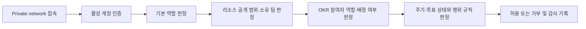

# 마크인포 문제 해결형 OKR 시스템 MVP 권한정책

| 항목 | 정책 |
| --- | --- |
| 문서 상태 | MVP 기준 확정안 |
| 적용 대상 | 사내 서버의 웹 애플리케이션, private network, Slack 단방향 전송, 외부 참고자료 |
| 기준 문서 | [PRD](./PRD.md), [기능명세서](./기능명세서.md), [화면흐름도](./화면흐름도.md), [기존 MVP 기획서](./local-okr-mvp-design.md) |
| 기본 원칙 | 인증·네트워크·역할·리소스 범위를 모두 통과해야 허용하며, 불명확한 경우 거부한다. |

## 1. 목적과 적용 원칙

이 정책은 약 40명, 약 10개 팀이 사용하는 사내 전용 OKR 시스템에서 **누가 어떤 데이터에 접근하고 무엇을 할 수 있는지** 정의한다. 조직의 목표·문제 해결 과정은 투명하게 공유하되, 타팀 협업과 개인 개발 목표가 불필요하게 노출되거나 변경되지 않도록 최소 권한을 적용한다.

1. **기본 거부와 서버 판정**: 화면에서 버튼을 숨기는 것만으로 권한을 처리하지 않는다. 모든 API는 서버에서 인증, 기본 역할, 소유 팀, 공개 범위, OKR 참여자 역할, 상태를 검증한다.
2. **한 명의 기본 소속 팀**: 활성 사용자는 정확히 하나의 기본 소속 팀을 가진다. 타팀 지원은 팀을 복제하거나 겸직 팀을 만드는 대신 목표별 참여자로만 표현한다.
3. **단일 최종 책임**: committed Objective와 KR은 각각 한 명의 최종 책임자를 가진다. 참여자는 책임자를 대체하거나 자동으로 소유 팀 권한을 얻지 않는다.
4. **필요한 범위만 공개**: 상위 목표를 볼 수 있다고 하위의 비공개 문제·근거·개인 목표까지 볼 수 있는 것은 아니다. 연결은 가시성을 확장하지 않는다.
5. **이력 우선**: 체크인, 결정, 상태 전환, closeout, Slack 전송, 권한 변경은 덮어쓰지 않고 감사 가능한 기록으로 남긴다.
6. **평가·보상 분리**: 이 MVP는 개인 평가, 점수·등급, 순위, 성과급·보상 자동 계산을 처리하지 않는다. OKR 파티의 인정 기록도 비순위형 기록일 뿐 평가 데이터가 아니다.

> [기존 MVP 기획서](./local-okr-mvp-design.md)의 정기 리뷰 점수·등급 항목은 최신 [PRD](./PRD.md)의 MVP 제외 범위와 충돌한다. 따라서 본 정책에서는 해당 데이터의 생성·조회·전송 권한을 정의하지 않으며, 추후 별도 인사 정책과 법무·HR 검토를 거쳐야 한다.

## 2. 권한 판정 순서

모든 요청은 아래 순서로 판정한다. 앞 단계에서 하나라도 실패하면 이후 조건과 관계없이 거부한다.

| 판정 항목 | 필수 기준 |
| --- | --- |
| 네트워크 | 사내망 또는 승인된 private network 기기에서만 접속한다. 공개 인터넷, 포트 포워딩, Tailscale Funnel은 허용하지 않는다. |
| 계정 | `active=true`인 앱 계정의 유효한 로그인만 세션을 만든다. 비활성화 계정과 기존 세션은 다음 인증 요청부터 거부한다. |
| 전역 역할 | 관리자, 팀 리더, 구성원 중 하나를 기본 역할로 가진다. 관리자 권한은 필요한 운영 담당자에게만 부여한다. |
| 리소스 범위 | 소유 팀, 공개 범위, 최종 책임자, 연결된 참여자, 작성자·담당자를 함께 확인한다. |
| 상태 | Draft/Alignment/Active/Closeout/Closed 및 문제 상태에 맞지 않는 쓰기 행위를 거부한다. |
| 외부 전송 | Slack 전송은 작성자의 미리보기와 같은 보고 버전에 대한 명시적 확인이 있어야만 허용한다. |

## 3. 역할 모델

### 3.1 전역 역할

| 역할 | 부여 방식 | 주된 범위 | 허용되는 핵심 행위 | 명시적 제한 |
| --- | --- | --- | --- | --- |
| 관리자 | 다른 관리자가 부여한다. 마지막 활성 관리자는 단독으로 비활성화·강등할 수 없다. | 전 조직 | 사용자·팀·역할·주기·개인 OKR 사용 설정·Slack 대상·전체 리포트·감사 로그 관리 | 비밀 값의 평문 조회, 임의 Slack 자동 발송, 평가·보상 산정은 불가 |
| 팀 리더 | 관리자가 팀별로 지정한다. | 자기 소유 팀과 그 팀이 소유한 리소스 | 팀 문제 검토·선정, 팀 Objective 합의·상태 전환, 팀 회의·보고·운영 현황 조회, 팀 협업 요청 확인 | 다른 팀 리소스의 운영 결정·소유권 변경은 불가. 참여자로 연결된 타팀 목표에는 참여자 권한만 적용 |
| 구성원 | 관리자가 활성 계정에 부여한다. | 기본 소속 팀과 자신이 접근 가능한 리소스 | 문제 제안, 권한이 있는 목표 초안·체크인·주간 보고·회의록·액션 아이템 작성, 피드백 | 팀 리더 확인이 필요한 합의·상태 전환·선정 결정, 조직 설정, 감사 로그 조회는 불가 |

### 3.2 목표별 참여자 역할

`contributor`, `reviewer`, `observer`는 전역 역할이 아니라 `OkrParticipant` 관계에만 부여한다. 모든 참여자는 목표를 읽을 수 있지만, 참여자 추가만으로 기본 소속 팀이나 전역 역할이 바뀌지 않는다.

| 참여자 역할 | 조회 | 댓글·멘션 | 체크인 | 액션 아이템 | 목표·상태·소유권 변경 |
| --- | --- | --- | --- | --- | --- |
| `contributor` | 연결된 목표·KR·허용된 연결 자료 | 가능 | 자신에게 배정된 Objective/KR에만 가능 | 자신에게 배정된 항목의 상태·결과물만 변경 가능 | 불가 |
| `reviewer` | 연결된 목표·KR·허용된 연결 자료 | 가능 | 불가 | 자신에게 별도 배정된 경우에만 상태 갱신 가능 | 불가 |
| `observer` | 연결된 목표·KR·허용된 연결 자료 | 불가 | 불가 | 불가 | 불가 |

- 목표의 최종 책임자와 소유 팀 리더는 참여자 목록과 별도로 유지한다.
- 목표 생성자, 최종 책임자, 소유 팀 리더 또는 관리자가 참여자를 추가·해제할 수 있다. 단, Active 이후 참여자 변경은 사유와 함께 감사 로그에 남긴다.
- 비공개 목표의 액션 아이템을 타팀 사용자에게 배정하려면 먼저 해당 사용자에게 최소 `contributor` 또는 `reviewer` 참여자 관계를 부여해야 한다. 배정만으로 비공개 목표 내용을 우회 공개해서는 안 된다.

## 4. 데이터 공개 범위

### 4.1 공통 공개 범위

모든 Problem, Objective, KR, 회의록, 주간 보고, 외부 참고자료에는 아래 중 하나의 접근 범위를 저장한다. 상위·하위 또는 링크 관계가 접근 범위를 자동 변경하지 않으며, 연결 화면은 **두 리소스에 모두 접근 가능한 사용자에게만** 표시한다.

| 범위 | 기본 열람자 | 편집·운영 권한자 | 사용 예 |
| --- | --- | --- | --- |
| `organization` | 모든 활성 앱 사용자 | 리소스별 소유자·리더·관리자 | 회사 목표, 전사 공유 팀 OKR, 공개 주간 보고 |
| `owner_team` | 소유 팀 구성원·팀 리더, 최종 책임자, 명시된 참여자, 관리자 | 리소스별 소유자·리더·관리자 | 탐색 중 문제, 팀 내부 회의록, 팀 운영 목표 |
| `participants_only` | 최종 책임자, 소유 팀 리더, 명시된 참여자, 관리자 | 리소스별 소유자·리더·관리자 | 개인 개발 Objective, 민감한 문제 근거, 제한 협업 |

기본값은 다음과 같다.

| 리소스 | 기본 범위 | 범위 변경 규칙 |
| --- | --- | --- |
| 회사 Objective/KR | `organization` | 관리자만 `organization` 외 범위로 변경할 수 있다. |
| 팀 Objective/KR | `organization` | 팀 리더가 `owner_team` 또는 `participants_only`로 제한할 수 있으며 사유를 남긴다. |
| 개인 개발 Objective/KR | `participants_only` | 팀별 개인 OKR 기능이 켜진 경우에만 생성한다. 조직 공개는 소유자와 팀 리더의 확인이 모두 있어야 한다. |
| 문제 | `owner_team` | 작성자는 Draft/Active 동안 더 좁힐 수 있고, 팀 리더 또는 관리자가 더 넓힐 수 있다. 선정 결정과 연결 근거는 원래 범위를 유지한다. |
| 회의록·액션 아이템 | 연결된 팀 또는 목표 중 가장 좁은 범위 | 더 넓게 공유하려면 팀 리더 또는 관리자의 사유 기록이 필요하다. |
| 주간 보고 | `owner_team` | Slack 전송 대상 보고는 `organization` 범위여야 하며, 비공개 연결 정보는 전송 본문에서 제외한다. |
| closeout·인정 기록 | 원래 목표의 범위 | Closed 이후 더 넓은 공개는 관리자와 소유 팀 리더의 확인 및 감사 사유가 필요하다. |

### 4.2 목록·검색·알림의 비노출 규칙

- 접근 권한이 없는 리소스는 목록, 검색 결과, 자동완성, 대시보드 집계, 멘션 후보, URL 미리보기에서 모두 제외한다.
- 권한이 없는 연결 리소스는 제목·작성자·존재 여부를 포함해 노출하지 않는다.
- 집계 리포트는 접근 가능한 범위의 팀·주기 단위 합계만 표시한다. 개인별 비교·순위·평가 지표는 제공하지 않는다.
- 멘션 후보는 댓글 대상 리소스에 이미 접근할 수 있는 활성 사용자만 보여 준다.

## 5. 리소스별 권한 정책

### 5.1 조직·계정·주기·운영 설정

| 리소스/행위 | 관리자 | 팀 리더 | 구성원 | 서버 운영 권한 |
| --- | --- | --- | --- | --- |
| 사용자 생성·활성화·비활성화·기본 팀·전역 역할 변경 | 허용 | 불가 | 불가 | 불가 |
| 팀 생성·리더 지정·개인 OKR opt-in 변경 | 허용 | 불가 | 불가 | 불가 |
| Cycle preset·custom 일정·상태 설정 | 허용 | 조회만 | 조회만 | 불가 |
| Slack 승인 채널·연동 상태 설정 | 허용 | 조회만 | 조회만 | 비밀 값 배포·교체만 |
| 감사 로그 조회 | 허용 | 불가 | 불가 | 운영 작업 로그만 |
| 백업·복구 점검 기록 | 허용 | 불가 | 불가 | 실행 및 결과 제출 |

`서버 운영 권한`은 앱 역할이 아니다. Docker, 데이터베이스, IdP, private network, Slack 웹훅 비밀 값을 다루는 별도 운영 권한이며, 필요 시 관리자에게 별도로 부여한다. 앱 관리자는 웹 화면에서 비밀 값의 존재·마지막 교체 시각·연동 상태만 볼 수 있고 원문은 볼 수 없다.

### 5.2 문제 백로그와 선정

| 행위 | 허용 주체 | 조건 |
| --- | --- | --- |
| 문제 등록 | 모든 활성 구성원·팀 리더·관리자 | 기본 소속 팀에 Draft 또는 Active 문제를 만든다. 탐색 단계에는 Objective/KR 연결이 없어도 된다. |
| 문제 필수 정보 수정 | 작성자, 소유 팀 리더, 관리자 | 작성자는 자신이 등록한 문제의 Draft/Active 필수 정보만 수정한다. Decided 이후의 결정 필드는 수정할 수 없다. |
| 근거·참고 링크·피드백 추가 | 리소스 접근자 중 `contributor`, 소유 팀 구성원, 리더, 관리자 | 기존 근거·피드백을 덮어쓰지 않고 새 항목으로 누적한다. |
| 우선순위·선정 결정 | 소유 팀 리더, 관리자 | `Accepted for Objective`, `Deferred`, `Rejected`, `Duplicate` 중 하나와 사유·결정자·결정일을 기록한다. |
| Objective/KR 연결 | 소유 팀 리더, 관리자 | `Accepted for Objective`인 결정에서만 시작한다. 대표 연결은 하나, 전체 연결은 복수 허용한다. |
| 아카이브 | 소유 팀 리더, 관리자 | hard delete 대신 상태 변경과 사유를 남긴다. |

### 5.3 Objective·KR·정렬·상태

| 행위 | 회사 Objective | 팀 Objective | 개인 개발 Objective |
| --- | --- | --- | --- |
| Draft 생성 | 관리자 | 소유 팀 구성원·리더·관리자 | 본인, 소유 팀 리더, 관리자. 팀 opt-in이 켜져 있어야 함 |
| Draft 편집·KR 추가 | 관리자 | 생성자·최종 책임자·팀 리더·관리자 | 소유자·팀 리더·관리자 |
| Alignment 확정·Active 전환 | 관리자 | 소유 팀 리더 또는 관리자 | 소유 팀 리더 또는 관리자 |
| Active의 구조 변경(제목, 범위, 소유 팀, 책임자, 기간, 공개 범위) | 관리자 | 소유 팀 리더 또는 관리자, 사유 필수 | 소유 팀 리더 또는 관리자, 사유 필수 |
| 체크인·실행 기록 | 최종 책임자 또는 배정 `contributor` | 최종 책임자 또는 배정 `contributor` | 최종 책임자 또는 배정 `contributor` |
| Closeout 결과 확정·Closed 전환 | 관리자 | 소유 팀 리더 또는 관리자 | 소유 팀 리더 또는 관리자 |

- 상태는 `Draft → Alignment → Active → Closeout → Closed` 순서로만 전환한다. 상태 전환자와 사유를 감사한다.
- Active가 아닌 목표에는 일반 체크인을 새로 작성할 수 없다.
- KR의 최종 책임자는 한 명이어야 하며, 책임자 변경은 Active 이후 감사 대상이다.
- Closed 주기의 Objective, KR, 체크인, 회의록, closeout은 읽기 전용이다. 오류 정정은 새 변경 기록 또는 관리자 정정으로 남기고 원본을 덮어쓰지 않는다.

### 5.4 체크인·피드백·의존성

| 행위 | 허용 주체 | 제한 |
| --- | --- | --- |
| 체크인 작성 | 최종 책임자 또는 해당 KR/Objective에 명시적으로 배정된 `contributor` | Active 상태·접근 범위 내에서만 가능 |
| 과거 체크인 정정 | 작성자는 새 체크인으로 정정 관계를 남김, 관리자는 예외 정정 가능 | 기존 값·메모 직접 덮어쓰기 금지. 관리자 정정은 전후 값·사유를 감사 |
| 댓글·피드백 | 목표에 쓰기 권한이 있는 소유 팀 구성원, `contributor`, `reviewer`, 리더, 관리자 | `observer`는 댓글 불가. 접근 가능한 사용자만 멘션 가능 |
| 도움 요청·의존성 생성 | 최종 책임자, `contributor`, 소유 팀 리더, 관리자 | 연결 대상·담당자·기한·상태가 필요하며, 대상 담당자에게 최소 읽기 권한을 부여한 뒤 알림 |
| 의존성 상태 갱신 | 요청 담당자, 대상 담당자, 소유 팀 리더, 관리자 | 변경 이력과 사유를 남김 |

### 5.5 주간 보고와 Slack

| 행위 | 허용 주체 | 제한 |
| --- | --- | --- |
| 주간 보고 초안 작성·수정 | 작성자, 소유 팀 리더, 관리자 | 작성자는 접근 가능한 OKR만 연결한다. 이전 버전은 보존한다. |
| 팀 보고 열람 | 리포트 범위의 열람자 | 팀 리더는 자기 소유 팀 보고를 조회할 수 있다. |
| Slack 미리보기 | 작성자, 소유 팀 리더, 관리자 | 승인된 고정 채널, 실제 전송 본문, 링크를 읽기 전용으로 표시한다. |
| Slack 전송·수동 재시도 | 해당 보고의 작성자 | 같은 보고 버전에 대한 본인 클릭과 최종 확인이 있어야 한다. 다른 사용자는 작성자 대신 전송할 수 없다. |
| 전송 이력 열람 | 리포트 범위의 열람자, 관리자 | 보고 버전·채널 ID·전송자·시각·메시지 ID 또는 실패 원인을 표시한다. |

Slack 전송은 다음 조건을 모두 만족할 때만 허용한다.

1. 관리자가 승인한 단일 `주간 보고 OKR` append-only 채널이다.
2. 보고가 `organization` 범위이고, 비공개 목표·개인 개발 목표·제한된 문제 근거·외부 비공개 링크를 본문에 포함하지 않는다.
3. 작성자가 미리보기를 확인한 동일 보고 버전에 대해 전송을 명시적으로 확정한다.
4. 동일 보고 버전·채널의 성공 이력이 없거나, 실패 후 작성자가 새 미리보기에서 수동 재시도를 확정한다.

MVP는 Slack 채널 읽기, 메시지 수정·삭제, 자동 발송, 자동 재시도를 요청하거나 실행하지 않는다.

### 5.6 회의록·액션 아이템·closeout·인정

| 행위 | 허용 주체 | 제한 |
| --- | --- | --- |
| 회의록 생성·작성 | 소유 팀 구성원, 팀 리더, 관리자 | 회의록 범위는 연결된 리소스 중 가장 좁은 범위 이하로 설정 |
| 회의록의 결정·위험·학습 확정 | 소유 팀 리더, 관리자 | 작성자는 초안을 만들 수 있으나 확정 권한은 리더·관리자에게 있음 |
| 액션 아이템 생성·배정 | 회의록 작성자, 팀 리더, 관리자 | 담당자는 활성 사용자여야 하며, 비공개 맥락이면 참여자 관계를 먼저 부여 |
| 액션 아이템 상태·결과물 갱신 | 담당자, 소유 팀 리더, 관리자 | 담당자는 자신의 항목만 변경 가능 |
| closeout 결과·이월 판단 | 최종 책임자 제안, 소유 팀 리더 또는 관리자 확정 | `중단/계속/재범위화/상시 업무 전환`과 사유 필수. 계속·재범위화는 다음 주기 연결 필수 |
| OKR 파티·인정 기록 | 소유 팀 리더, 관리자 | 성과·시행착오·학습·근거만 기록. 개인 평가·순위·보상 계산에 사용 금지 |

### 5.7 외부 참고자료와 리포트

| 행위 | 허용 주체 | 제한 |
| --- | --- | --- |
| Notion·Google·회의 링크 첨부 | 연결 대상에 편집 권한이 있는 사용자 | URL/식별자·작성자·등록 시각만 보관. 원본 권한은 각 외부 서비스에서 별도로 판정 |
| 외부 원본 열기 | 해당 외부 서비스에서도 권한이 있는 사용자 | 앱의 링크 권한이 Notion·Google 권한을 부여하거나 우회하지 않는다. |
| Google Sheets A1 범위 일회성 스냅샷 | 관리자 | 승인된 Sheet와 범위만, read-only로 한 번 가져온다. 원본 수정·권한 변경·양방향 동기화 금지 |
| 기본 운영 리포트 열람 | 관리자: 전체 / 팀 리더: 자기 소유 팀 / 구성원: 자신의 접근 범위 요약 | 개인 비교·순위·평가·보상 관련 분석을 제공하지 않는다. |

## 6. 관리·감사·보안 통제

### 6.1 감사 대상과 열람

아래 행위는 `actor`, `occurred_at`, 대상 리소스, 행위, 변경 전후 값, 사유를 포함한 `AuditEvent`로 남긴다.

- 로그인 성공·실패, 계정 활성화/비활성화, 역할·기본 팀·팀 리더 변경
- 팀 개인 OKR opt-in, Cycle 일정·상태, Slack 승인 채널 및 연동 상태 변경
- 문제 선정 결정, Objective/KR의 구조·책임자·공개 범위·상태 변경
- 참여자 추가·해제, 관리자 체크인 정정, closeout·이월 확정
- Slack 전송 시도·성공·실패·수동 재시도, Google Sheets 스냅샷, 백업·복구 점검

감사 로그는 관리자만 조회할 수 있으며, 일반 화면에서 편집·삭제할 수 없다. 감사 로그 보관 기간 변경 또는 파기는 별도 운영 결정과 승인 기록이 없는 한 수행하지 않는다.

### 6.2 계정·세션·접속 해제

- IdP MFA를 포함한 private network 허용 정책과 앱 로그인은 별개로 적용한다.
- 세션은 유휴 30분 또는 발급 후 8시간에 만료한다. 권한·팀·활성 상태의 변경은 다음 인증 요청부터 즉시 반영한다.
- 퇴사·휴직·역할 이동 처리 시 관리자는 앱 계정 비활성화, 전역 역할/팀 관계 해제, private network 기기·초대 철회를 같은 운영 항목으로 확인하고 감사한다.
- 데이터베이스는 외부 포트를 열지 않고 앱 내부 네트워크에서만 접근한다. private network 내부 통신에도 TLS를 사용한다.

### 6.3 비밀 값과 백업

- 비밀번호는 단방향 해시로만 저장한다. Slack 웹훅, DB 비밀번호, IdP 비밀 값은 코드·Git·화면·감사 로그에 기록하지 않는다.
- 비밀 값은 서버의 보호된 비밀 저장소 또는 접근 제한된 설정 파일로만 주입하며, 로그에는 마스킹된 식별자만 남긴다.
- 데이터베이스 백업은 정기 실행하고, 월 1회 복구 점검의 시각·결과·이슈·조치를 기록한다. 백업 위치와 내용은 일반 사용자 화면에 노출하지 않는다.

## 7. 권한 변경 운영 절차

1. **요청**: 팀 리더 변경, 역할 변경, private network 초대/철회는 운영 담당자에게 요청한다.
2. **검증**: 관리자는 필요성, 기본 소속 팀, 기존 참여자·액션 아이템·최종 책임 관계의 영향을 확인한다.
3. **적용**: 역할·팀·참여자·계정 상태를 최소 범위로 변경하고, 기존 세션을 다음 요청부터 무효화한다.
4. **기록**: 변경 사유, 변경 전후 값, 수행자, 시각, private network 처리 여부를 감사 로그에 남긴다.
5. **확인**: 변경 대상자와 팀 리더가 ‘내 OKR/내 협업’ 화면에서 기대 범위가 맞는지 확인한다.

권한이 부족한 사용자는 ‘권한 없음’만 안내받으며, 숨겨진 리소스의 제목·존재 여부·다른 사용자의 개인 정보는 제공받지 않는다. 접근이 필요한 경우에는 리소스 소유 팀 리더 또는 관리자에게 참여자 추가·범위 조정을 요청한다.

## 8. 수용 기준과 문서 추적

본 정책은 다음 기능 수용 기준을 직접 구현 기준으로 삼는다.

| 정책 영역 | 연결된 기능 명세 |
| --- | --- |
| private network·로그인·RBAC·세션 | `F-001` ~ `F-003` |
| 팀·개인 OKR opt-in·주기·감사 | `F-004` ~ `F-007` |
| 비공개 문제 비노출·선정 | `F-010` ~ `F-014` |
| Objective/KR·참여자·상태 전환 | `F-020` ~ `F-025` |
| 체크인 정정·댓글·의존성 | `F-030` ~ `F-035` |
| 주간 보고·Slack 직접 전송 | `F-040` ~ `F-043` |
| 회의록·액션 아이템·closeout | `F-050` ~ `F-063` |
| 외부 링크·Sheet 스냅샷·리포트·백업 | `F-070` ~ `F-073` |

구현 시 각 API와 화면 동작은 이 정책과 해당 `AC-F-xxx-yy`를 함께 충족해야 한다. 화면의 편의 기능이나 링크 관계가 이 문서의 서버 측 권한 검증을 우회해서는 안 된다.
