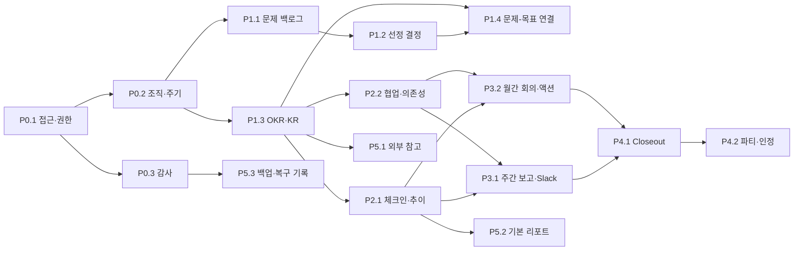

# 마크인포 문제 해결형 OKR 시스템 MVP 기능명세서

이 문서는 [기존 MVP 기획서](./local-okr-mvp-design.md), [시장조사 종합본](../.omo/ulw-research/20260902-okr-market-research/SYNTHESIS.md), [PRD](./PRD.md), [화면흐름도](./화면흐름도.md)를 구현 가능한 원자 단위로 분해한다. 각 `F-` 항목은 독립적으로 완료·검증할 수 있는 기능 최소 단위이며, `선행 작업` 링크를 모두 완료해야 착수할 수 있다.

## 1. 표기와 우선순위

| 표기 | 의미 |
| --- | --- |
| `P0.1` | MVP가 실행되기 위한 기반. 이후 모든 사용자 기능의 선행 조건 |
| `P1.x` | 문제를 목표로 선정·정렬하는 첫 운영 가치 |
| `P2.x` | 실행 상태를 기록하고 협업하는 두 번째 운영 가치 |
| `P3.x` | 주간·월간 소통 의식 |
| `P4.x` | 주기 마감, 이월, 인정 기록 |
| `P5.x` | 링크 참조·기본 리포트·운영 회복력. 파일럿 이후 확장 |
| `AC-F-xxx-yy` | 해당 기능이 완료되었다고 판정할 수 있는 원자적 수용 기준 |

### 구현 규칙

- `선행 작업`에 적힌 모든 링크가 완료될 때까지 해당 기능을 시작하지 않는다.
- 동일 우선순위 안에서는 선행 링크가 없는 항목부터 병렬 착수할 수 있다.
- `개인 개발 목표`, `OKR 파티 인정`, `Google Sheets 스냅샷`은 기능 플래그 또는 운영 설정으로 활성화하는 선택 범위다.
- 급여·승진·성과급·순위·자동 포인트, 자동 Slack 발송, Slack 읽기/봇, 양방향 Notion·Google 동기화, AI 기능, 범용 프로젝트 관리는 MVP에서 구현하지 않는다.

## 2. 우선순위·의존성 지도

| 우선순위 | 완료 게이트 | 포함 기능 |
| --- | --- | --- |
| P0.1 | 승인된 사용자만 로그인하고 역할 밖의 기능을 수행할 수 없다. | F-001 ~ F-003 |
| P0.2 | 팀·사용자·주기를 설정한 뒤 목표 데이터를 생성할 수 있다. | F-004 ~ F-006 |
| P0.3 | 중요 변경의 행위자와 시각을 추적할 수 있다. | F-007 |
| P1.1 | 문제를 수집·검토하고 상태별로 찾을 수 있다. | F-010 ~ F-012 |
| P1.2 | 선정 결정의 근거와 처리 상태가 보존된다. | F-013 |
| P1.3 | 회사·팀 OKR과 KR을 합의·활성화할 수 있다. | F-020 ~ F-025 |
| P1.4 | 선정된 문제를 Objective 또는 KR에 연결한다. | F-014 |
| P2.1 | 실행 관측치와 실제/기대 추이를 이력으로 볼 수 있다. | F-030 ~ F-032 |
| P2.2 | 피드백·협업·지원 요청의 책임을 분리해 기록할 수 있다. | F-033 ~ F-035 |
| P3.1 | 작성자가 확인한 주간 보고만 Slack에 단방향 전송된다. | F-040 ~ F-043 |
| P3.2 | 월간 결정과 후속 액션이 OKR에 연결된다. | F-050 ~ F-051 |
| P4.1 | Closeout 결과와 미완료 항목의 처리 결정이 보존된다. | F-060 ~ F-062 |
| P4.2 | 비순위형 성과·학습 기록을 남길 수 있다. | F-063 |
| P5.1 | 외부 원본의 링크와 제한된 스냅샷 상태를 관리한다. | F-070 ~ F-071 |
| P5.2 | 운영자가 핵심 작성·진행 현황을 확인한다. | F-072 |
| P5.3 | 백업·복구 점검 결과를 운영 기록으로 남긴다. | F-073 |

## 3. P0.1 접근·권한

### F-001. 비공개 네트워크 로그인

- **우선순위:** P0.1
- **선행 작업:** 없음
- **완료 단위:** 승인된 사내·원격 사용자가 인증 후 홈으로 진입한다.
- **AC 트리:**
  - `AC-F-001-01` 허용 네트워크와 활성 계정의 유효한 로그인만 세션을 생성한다.
  - `AC-F-001-02` 인증되지 않은 요청은 데이터·관리 화면 대신 로그인 화면으로 이동한다.
  - `AC-F-001-03` 공개 인터넷 경로, 포트 포워딩, Tailscale Funnel을 사용하지 않는다.

### F-002. 서버 측 역할 기반 접근 제어

- **우선순위:** P0.1
- **선행 작업:** [F-001](#f-001-private-login)
- **완료 단위:** 관리자·팀 리더·구성원·협업자의 역할과 리소스 범위를 서버에서 판정한다.
- **AC 트리:**
  - `AC-F-002-01` 관리 기능은 관리자만 실행할 수 있다.
  - `AC-F-002-02` 팀 리더는 자기 소유 팀의 문제 검토·목표 합의·팀 기록 조회만 실행할 수 있다.
  - `AC-F-002-03` 협업자는 연결된 OKR에서만 댓글, 배정된 체크인 또는 액션 아이템을 작성할 수 있다.

### F-003. 계정 활성 상태와 세션 종료

- **우선순위:** P0.1
- **선행 작업:** [F-001](#f-001-private-login), [F-002](#f-002-server-rbac)
- **완료 단위:** 비활성화·역할 변경된 계정이 즉시 권한을 잃는다.
- **AC 트리:**
  - `AC-F-003-01` 비활성 계정은 새 로그인과 기존 세션의 다음 인증 요청 모두 거부된다.
  - `AC-F-003-02` 역할 또는 팀 변경 후 다음 요청부터 새 권한 범위를 적용한다.
  - `AC-F-003-03` 퇴사·이동 처리 시 앱 계정, 팀 역할, private network 접근 해제 확인을 운영자가 기록한다.

## 4. P0.2 조직·주기·감사 기반

### F-004. 팀과 사용자 관리

- **우선순위:** P0.2
- **선행 작업:** [F-002](#f-002-server-rbac)
- **완료 단위:** 관리자가 팀, 팀 리더, 사용자의 기본 소속 팀을 관리한다.
- **AC 트리:**
  - `AC-F-004-01` 사용자는 정확히 하나의 기본 소속 팀을 가진다.
  - `AC-F-004-02` 팀마다 팀 리더를 지정·변경할 수 있다.
  - `AC-F-004-03` 타 팀 지원은 팀 소속 복제가 아니라 OKR 참여 관계로만 등록한다.

### F-005. 팀별 개인 개발 목표 사용 설정

- **우선순위:** P0.2
- **선행 작업:** [F-004](#f-004-team-user-admin)
- **완료 단위:** 팀별로 개인 개발 목표 기능을 선택적으로 켜고 끈다.
- **AC 트리:**
  - `AC-F-005-01` 관리자는 팀 단위로 개인 개발 목표 사용 여부를 변경할 수 있다.
  - `AC-F-005-02` 기능이 꺼진 팀은 개인 Objective 생성 진입점을 표시하지 않는다.
  - `AC-F-005-03` 일반 업무는 이 설정과 무관하게 팀 KR의 책임자 또는 협업자로 표현한다.

### F-006. 유연한 OKR 주기 설정

- **우선순위:** P0.2
- **선행 작업:** [F-004](#f-004-team-user-admin)
- **완료 단위:** 관리자가 반기 4+1+1, 분기 또는 custom 주기를 만든다.
- **AC 트리:**
  - `AC-F-006-01` preset은 실행·closeout·다음 주기 합의 기간을 각각 표시한다.
  - `AC-F-006-02` custom 주기는 Draft, Alignment, Active, Closeout, Closed 상태와 각 날짜를 저장한다.
  - `AC-F-006-03` 다음 주기의 Draft/Alignment는 현재 주기의 Active/Closeout과 동시에 존재할 수 있다.

### F-007. 중요 행위 감사 기록

- **우선순위:** P0.3
- **선행 작업:** [F-002](#f-002-server-rbac)
- **완료 단위:** 중요 변경과 외부 전송의 감사 이벤트를 남긴다.
- **AC 트리:**
  - `AC-F-007-01` 로그인, 권한 변경, 주기 상태 변경, 중요 목표 변경, Slack 전송을 기록한다.
  - `AC-F-007-02` 각 이벤트는 행위자, 시각, 대상, 변경 전후 값, 사유를 포함한다.
  - `AC-F-007-03` 감사 로그 조회는 관리자에게만 허용한다.

## 5. P1.1 문제 백로그

### F-010. 문제 제안 등록

- **우선순위:** P1.1
- **선행 작업:** [F-004](#f-004-team-user-admin), [F-006](#f-006-cycle-configuration)
- **완료 단위:** 구성원이 문제 설명과 해결 아이디어를 팀·주기에 연결해 저장한다.
- **AC 트리:**
  - `AC-F-010-01` 문제 설명, 제안 아이디어, 작성자, 팀, 주기를 입력해 Draft 또는 Active 문제를 만든다.
  - `AC-F-010-02` 탐색 단계의 문제는 Objective/KR 연결 없이 저장할 수 있다.
  - `AC-F-010-03` 작성자는 자신이 등록한 문제의 필수 정보를 수정할 수 있다.

### F-011. 문제 근거와 검토 피드백

- **우선순위:** P1.1
- **선행 작업:** [F-010](#f-010-problem-create)
- **완료 단위:** 문제에 근거·참고 링크·메모·리더 또는 개발 피드백을 누적한다.
- **AC 트리:**
  - `AC-F-011-01` 하나의 문제에 복수의 링크 또는 메모 근거를 연결할 수 있다.
  - `AC-F-011-02` 권한 있는 참여자는 문제에 댓글형 피드백을 남길 수 있다.
  - `AC-F-011-03` 새 근거와 피드백은 기존 항목을 덮어쓰지 않고 이력으로 남는다.

### F-012. 문제 백로그 목록과 필터

- **우선순위:** P1.1
- **선행 작업:** [F-010](#f-010-problem-create)
- **완료 단위:** 사용자가 팀·상태·우선순위·주기별로 문제를 찾는다.
- **AC 트리:**
  - `AC-F-012-01` 목록은 팀, 상태, 우선순위, 주기 필터를 조합해 적용한다.
  - `AC-F-012-02` 각 항목은 대표 문제-목표 연결과 최근 결정 상태를 표시한다.
  - `AC-F-012-03` 권한이 없는 팀의 비공개 문제는 목록과 검색 결과에 노출하지 않는다.

## 6. P1.2 선정 결정과 P1.4 문제-목표 연결

### F-013. 문제 우선순위와 선정 결정

- **우선순위:** P1.2
- **선행 작업:** [F-011](#f-011-problem-evidence-feedback), [F-012](#f-012-problem-list-filter)
- **완료 단위:** 운영 권한자가 문제의 우선순위와 명시적 결정을 남긴다.
- **AC 트리:**
  - `AC-F-013-01` 중요도와 결정 상태를 `Accepted for Objective`, `Deferred`, `Rejected`, `Duplicate` 중 하나로 저장한다.
  - `AC-F-013-02` 모든 결정은 사유, 결정자, 결정일을 포함한다.
  - `AC-F-013-03` Deferred는 다음 검토일을, Rejected는 거절 사유를, Duplicate는 대표 문제 링크를 요구한다.

### F-014. 선정 문제의 Objective 또는 KR 연결

- **우선순위:** P1.4
- **선행 작업:** [F-013](#f-013-problem-decision), [F-020](#f-020-objective-draft), [F-021](#f-021-key-result-create)
- **완료 단위:** 선정된 문제를 새 Objective 초안 또는 기존 Objective/KR에 연결한다.
- **AC 트리:**
  - `AC-F-014-01` `Accepted for Objective` 상태의 결정만 Objective 초안 생성 또는 기존 Objective/KR 연결을 시작할 수 있다.
  - `AC-F-014-02` 연결 시 결정 사유·결정자·결정일과 대상 Objective/KR을 보존한다.
  - `AC-F-014-03` 복수 연결은 허용하되, 화면에는 대표 연결을 하나 지정한다.

## 7. P1.3 OKR·KR 작성과 합의

### F-020. Objective 초안 작성

- **우선순위:** P1.3
- **선행 작업:** [F-004](#f-004-team-user-admin), [F-006](#f-006-cycle-configuration)
- **완료 단위:** 권한 있는 사용자가 회사·팀·허용된 개인 개발 Objective 초안을 만든다.
- **AC 트리:**
  - `AC-F-020-01` 제목, 문제 가설/설명, 소유 팀, 단일 최종 책임자, 기간, 공개 범위를 입력한다.
  - `AC-F-020-02` 개인 Objective는 해당 팀의 [F-005](#f-005-personal-okr-setting) 설정이 켜진 경우에만 생성할 수 있다.
  - `AC-F-020-03` 새 Objective의 초기 상태는 Draft다.

### F-021. KR 작성과 책임자 지정

- **우선순위:** P1.3
- **선행 작업:** [F-020](#f-020-objective-draft)
- **완료 단위:** Objective 아래에 측정 가능한 KR을 만들고 단일 책임자를 둔다.
- **AC 트리:**
  - `AC-F-021-01` KR은 측정 단위, 시작값, 목표값, 현재값, 기간, 책임자를 입력한다.
  - `AC-F-021-02` committed Objective/KR마다 최종 책임자는 정확히 한 명이다.
  - `AC-F-021-03` 실행 항목은 KR과 별도의 간단 항목 또는 링크로 연결하며 KR 값과 혼동하지 않는다.

### F-022. 목표 정렬 관계와 합의

- **우선순위:** P1.3
- **선행 작업:** [F-020](#f-020-objective-draft), [F-021](#f-021-key-result-create)
- **완료 단위:** 회사·팀·개인 개발 목표의 정렬 관계를 합의한다.
- **AC 트리:**
  - `AC-F-022-01` 팀 Objective는 회사 Objective 또는 회사 KR과 정렬 관계를 저장할 수 있다.
  - `AC-F-022-02` 목표 상세에서 상위·하위 또는 정렬 관계를 조회할 수 있다.
  - `AC-F-022-03` Alignment 확정에는 팀 리더의 확인과 변경 사유를 기록한다.

### F-023. 목표와 주기 상태 전환

- **우선순위:** P1.3
- **선행 작업:** [F-006](#f-006-cycle-configuration), [F-022](#f-022-goal-alignment), [F-007](#f-007-audit-events)
- **완료 단위:** 권한과 사유를 확인하며 Draft부터 Closed까지 상태를 전환한다.
- **AC 트리:**
  - `AC-F-023-01` 상태는 Draft → Alignment → Active → Closeout → Closed 순서로만 진행한다.
  - `AC-F-023-02` 팀 리더 또는 권한 있는 운영자가 상태 변경 사유를 입력한다.
  - `AC-F-023-03` 상태 변경 이벤트는 감사 로그에 기록한다.

### F-024. 목표 보드와 상세 보기

- **우선순위:** P1.3
- **선행 작업:** [F-021](#f-021-key-result-create), [F-022](#f-022-goal-alignment)
- **완료 단위:** 사용자가 회사·팀·개인 개발 목표와 KR의 계층을 조회한다.
- **AC 트리:**
  - `AC-F-024-01` 보드는 목표 제목, 상태, 기간, 책임자, 진행률을 계층형으로 표시한다.
  - `AC-F-024-02` 팀, 주기, 상태, 담당자 필터로 보드 범위를 줄일 수 있다.
  - `AC-F-024-03` 목표 상세에서 문제·근거·KR·참여자·체크인 이력으로 이동할 수 있다.

### F-025. OKR 참여자 역할 관리

- **우선순위:** P1.3
- **선행 작업:** [F-004](#f-004-team-user-admin), [F-020](#f-020-objective-draft)
- **완료 단위:** 소유 팀·최종 책임자와 별개로 협업자를 연결한다.
- **AC 트리:**
  - `AC-F-025-01` `contributor`, `reviewer`, `observer` 중 하나의 참여 역할을 OKR에 추가·해제한다.
  - `AC-F-025-02` 소유 팀과 최종 책임자는 참여자 목록과 별도 필드로 유지한다.
  - `AC-F-025-03` 참여자 변경은 해당 사용자와 목표 상세에서 확인할 수 있다.

## 8. P2.1 체크인·추이

### F-030. KR·Objective 체크인 작성

- **우선순위:** P2.1
- **선행 작업:** [F-023](#f-023-goal-state-transition), [F-021](#f-021-key-result-create)
- **완료 단위:** 책임자 또는 배정된 협업자가 활성 목표의 실행 관측치를 남긴다.
- **AC 트리:**
  - `AC-F-030-01` 현재값, 건강 상태(`on track`, `at risk`, `off track`), 성과, 이슈, 다음 행동, 관측일을 저장한다.
  - `AC-F-030-02` 작성자와 관측 대상 Objective 또는 KR을 함께 저장한다.
  - `AC-F-030-03` Active 상태가 아닌 목표에는 일반 체크인을 새로 작성할 수 없다.

### F-031. 체크인 이력 보존과 정정

- **우선순위:** P2.1
- **선행 작업:** [F-030](#f-030-checkin-create), [F-007](#f-007-audit-events)
- **완료 단위:** 과거 체크인을 덮어쓰지 않고 정정 관계를 남긴다.
- **AC 트리:**
  - `AC-F-031-01` 일반 사용자는 과거 체크인의 값·메모를 직접 덮어쓸 수 없다.
  - `AC-F-031-02` 정정은 새 체크인과 원본 참조를 저장한다.
  - `AC-F-031-03` 관리자 변경은 변경 전후 값과 사유를 감사 로그에 남긴다.

### F-032. 실제·기대 진행 추이

- **우선순위:** P2.1
- **선행 작업:** [F-030](#f-030-checkin-create), [F-031](#f-031-checkin-history)
- **완료 단위:** 목표 상세에서 실제 관측치와 기간 기준 기대 진행을 비교한다.
- **AC 트리:**
  - `AC-F-032-01` KR 또는 Objective별 체크인 값을 날짜순 이력으로 표시한다.
  - `AC-F-032-02` 실제 진행선과 기간 기준 기대 진행선을 같은 범위에서 표시한다.
  - `AC-F-032-03` 정정된 관측치는 원본과의 관계를 확인할 수 있다.

## 9. P2.2 피드백·협업·의존성

### F-033. 목표·체크인 피드백과 멘션

- **우선순위:** P2.2
- **선행 작업:** [F-025](#f-025-goal-participant), [F-030](#f-030-checkin-create)
- **완료 단위:** 참여자가 접근 가능한 목표 또는 체크인에 댓글을 남긴다.
- **AC 트리:**
  - `AC-F-033-01` 목표와 체크인 각각에 댓글형 피드백을 작성한다.
  - `AC-F-033-02` 멘션 대상은 해당 목표의 접근 권한이 있는 사용자만 선택한다.
  - `AC-F-033-03` 댓글은 작성자·작성 시각·대상 링크와 함께 보존한다.

### F-034. 도움 요청과 OKR 의존성

- **우선순위:** P2.2
- **선행 작업:** [F-025](#f-025-goal-participant), [F-030](#f-030-checkin-create)
- **완료 단위:** 위험 상태의 실행을 다른 팀·OKR 지원 요청과 연결한다.
- **AC 트리:**
  - `AC-F-034-01` `at risk` 또는 `off track` 체크인에 도움 요청 또는 의존성을 연결할 수 있다.
  - `AC-F-034-02` 의존성은 출발·대상 OKR, 담당자, 기한, 상태를 가진다.
  - `AC-F-034-03` 대상 담당자는 자신의 협업 목록에서 새 지원 요청을 확인한다.

### F-035. 내 OKR·협업 작업 분리 보기

- **우선순위:** P2.2
- **선행 작업:** [F-024](#f-024-goal-board), [F-025](#f-025-goal-participant), [F-034](#f-034-support-dependency)
- **완료 단위:** 홈과 내 협업 화면에서 자신의 관계별 할 일을 구분한다.
- **AC 트리:**
  - `AC-F-035-01` 내 소속 팀 OKR, 내 최종 책임 OKR, 협업 중 OKR을 별도 목록으로 표시한다.
  - `AC-F-035-02` 미작성 체크인, 받은 피드백, 미해결 도움 요청을 우선 표시한다.
  - `AC-F-035-03` 다른 팀 협업은 기본 소속 팀을 변경하지 않는다.

## 10. P3.1 주간 보고와 Slack

### F-040. 주간 보고 초안 작성

- **우선순위:** P3.1
- **선행 작업:** [F-030](#f-030-checkin-create), [F-035](#f-035-my-work)
- **완료 단위:** 작성자가 관련 OKR에 대한 지난주 성과·이번 주 계획·위험을 주차별로 저장한다.
- **AC 트리:**
  - `AC-F-040-01` 보고는 팀, 주기, 주차, 작성자, 관련 OKR을 가진다.
  - `AC-F-040-02` 지난주 성과, 이번 주 계획, 위험 또는 도움 요청을 입력한다.
  - `AC-F-040-03` 전송 전후의 보고 버전을 보존한다.

### F-041. Slack 전송 미리보기와 확인

- **우선순위:** P3.1
- **선행 작업:** [F-040](#f-040-weekly-report-draft)
- **완료 단위:** 작성자가 전송 직전 채널·내용·연결 URL을 읽기 전용으로 확인한다.
- **AC 트리:**
  - `AC-F-041-01` 미리보기는 지정 채널, 전송할 메시지, 연결 URL을 표시한다.
  - `AC-F-041-02` 사용자가 최종 확인을 누르지 않으면 외부 전송 요청을 만들지 않는다.
  - `AC-F-041-03` 확인 취소 시 보고는 초안으로 유지한다.

### F-042. Slack 고정 채널 직접 전송

- **우선순위:** P3.1
- **선행 작업:** [F-041](#f-041-slack-preview), [F-007](#f-007-audit-events)
- **완료 단위:** 사용자의 명시적 확인 후 승인된 단일 채널에 보고를 게시한다.
- **AC 트리:**
  - `AC-F-042-01` 사용자 클릭과 확인이 같은 보고 버전에 대해 존재할 때만 전송한다.
  - `AC-F-042-02` MVP는 승인된 단일 append-only 채널로만 단방향 전송한다.
  - `AC-F-042-03` 웹훅·비밀 값은 화면, 소스 코드, Git에 노출하지 않는다.

### F-043. Slack 전송 결과·중복 방지·수동 재시도

- **우선순위:** P3.1
- **선행 작업:** [F-042](#f-042-slack-direct-send)
- **완료 단위:** 전송 시도와 결과를 버전·채널 단위로 남기고 사용자가 재시도한다.
- **AC 트리:**
  - `AC-F-043-01` 보고 버전, 채널 ID, 전송자, 시각, 메시지 ID 또는 실패 원인을 저장한다.
  - `AC-F-043-02` 같은 보고 버전·채널 조합의 성공 이력은 중복 전송 대신 성공 상태를 표시한다.
  - `AC-F-043-03` 불명확한 실패를 자동 재시도하지 않으며, 사용자가 미리보기에서 수동 재시도한다.

## 11. P3.2 월간 회의와 액션 아이템

### F-050. 월간 회의록과 운영 결정 기록

- **우선순위:** P3.2
- **선행 작업:** [F-024](#f-024-goal-board), [F-032](#f-032-progress-trend), [F-033](#f-033-goal-feedback)
- **완료 단위:** 팀이 월간 회의의 논의와 결정·위험·학습을 기록한다.
- **AC 트리:**
  - `AC-F-050-01` 일시, 참석자, 안건, 논의, 결정, 위험, 학습을 저장한다.
  - `AC-F-050-02` 회의록은 문제, Objective, KR, 주간 보고를 복수 연결할 수 있다.
  - `AC-F-050-03` 팀별·주기별 월간 회의 목록에서 미결 결정과 위험을 확인한다.

### F-051. 회의 액션 아이템 관리

- **우선순위:** P3.2
- **선행 작업:** [F-050](#f-050-meeting-note), [F-025](#f-025-goal-participant)
- **완료 단위:** 회의 결정의 후속 행동을 담당자·기한·목표와 연결한다.
- **AC 트리:**
  - `AC-F-051-01` 액션 아이템은 담당자, 기한, 상태, 결과물 링크, 연결 목표를 가진다.
  - `AC-F-051-02` 담당자는 자신의 협업 목록에서 배정된 미완료 항목을 확인한다.
  - `AC-F-051-03` 월간 보기에서 팀의 미완료 액션 아이템을 조회한다.

## 12. P4.1 Closeout과 이월

### F-060. Closeout 최종 결과 확정

- **우선순위:** P4.1
- **선행 작업:** [F-023](#f-023-goal-state-transition), [F-032](#f-032-progress-trend), [F-050](#f-050-meeting-note)
- **완료 단위:** Closeout에서 KR 최종값, 문제 결과, 학습을 확정한다.
- **AC 트리:**
  - `AC-F-060-01` 각 KR의 최종값과 상태를 기록한다.
  - `AC-F-060-02` 관련 문제 결과를 `해결`, `진행 중`, `해결 불가`, `다음 주기 재검토` 중 하나로 기록한다.
  - `AC-F-060-03` 목표·문제별 배운 점을 결과와 함께 보존한다.

### F-061. 미완료 항목의 명시적 이월 판단

- **우선순위:** P4.1
- **선행 작업:** [F-060](#f-060-closeout-result), [F-006](#f-006-cycle-configuration)
- **완료 단위:** 미완료 항목을 자동으로 넘기지 않고 처리 방식과 후속 연결을 확정한다.
- **AC 트리:**
  - `AC-F-061-01` 미완료 항목마다 `중단`, `계속`, `재범위화`, `상시 업무 전환` 중 하나를 선택한다.
  - `AC-F-061-02` 선택 사유를 필수로 기록한다.
  - `AC-F-061-03` 계속 또는 재범위화는 다음 주기의 후속 목표 링크를, 상시 업무 전환은 운영 전환 기록을 남긴다.

### F-062. Closed 주기의 읽기 전용 이력

- **우선순위:** P4.1
- **선행 작업:** [F-061](#f-061-carry-decision), [F-007](#f-007-audit-events)
- **완료 단위:** 마감된 주기를 원본 훼손 없이 조회한다.
- **AC 트리:**
  - `AC-F-062-01` Closed 주기의 Objective, KR, 체크인, 회의록, closeout 결과는 읽기 전용이다.
  - `AC-F-062-02` 필요한 정정은 새 변경 이력으로만 남기며 원본 결과를 덮어쓰지 않는다.
  - `AC-F-062-03` 마감과 정정 관련 행위는 감사 로그에서 조회할 수 있다.

## 13. P4.2 OKR 파티와 비순위형 인정

### F-063. OKR 파티·성과·인정 기록

- **우선순위:** P4.2
- **선행 작업:** [F-060](#f-060-closeout-result), [F-062](#f-062-closed-history)
- **완료 단위:** 주기 종료 시 팀의 성과·시행착오·학습과 비순위형 인정 후보를 기록한다.
- **AC 트리:**
  - `AC-F-063-01` 일정, 발표 자료 링크, 팀 성과, 시행착오, 학습을 저장한다.
  - `AC-F-063-02` 고객 임팩트, 협업, 학습, 운영 개선 카테고리별 후보와 근거를 저장한다.
  - `AC-F-063-03` 인정 기록을 개인 평가, 순위, 보상 계산에 사용하지 않는다.

## 14. P5.1 외부 참고자료

### F-070. Notion·Google·회의 자료 링크 보관

- **우선순위:** P5.1
- **선행 작업:** [F-010](#f-010-problem-create), [F-020](#f-020-objective-draft), [F-050](#f-050-meeting-note)
- **완료 단위:** 문제·OKR·회의록에 외부 원본 링크와 식별 정보를 연결한다.
- **AC 트리:**
  - `AC-F-070-01` Notion page ID/URL, Drive file ID/URL, Sheet ID·시트명·A1 범위, 회의 URL을 저장한다.
  - `AC-F-070-02` 링크는 연결 대상과 작성자·등록 시각을 함께 보존한다.
  - `AC-F-070-03` 원본 접근 만료, 권한 없음, 링크 오류 상태를 표시한다.

### F-071. 승인된 Google Sheets 범위 일회성 스냅샷

- **우선순위:** P5.1
- **선행 작업:** [F-070](#f-070-external-reference-link), [F-002](#f-002-server-rbac)
- **완료 단위:** 관리자가 승인한 Sheet 범위만 참조용 스냅샷으로 저장한다.
- **AC 트리:**
  - `AC-F-071-01` 관리자만 특정 Sheet와 A1 범위를 지정해 일회성 가져오기를 실행한다.
  - `AC-F-071-02` 스냅샷은 원본 ID, 범위, 가져온 시각, 해시를 저장한다.
  - `AC-F-071-03` 원본 수정·권한 변경·양방향 동기화는 실행하지 않는다.

## 15. P5.2 기본 리포트

### F-072. 운영 현황 기본 리포트

- **우선순위:** P5.2
- **선행 작업:** [F-032](#f-032-progress-trend), [F-040](#f-040-weekly-report-draft), [F-050](#f-050-meeting-note), [F-060](#f-060-closeout-result)
- **완료 단위:** 관리자·리더가 작성률과 진행 현황을 확인한다.
- **AC 트리:**
  - `AC-F-072-01` 활성 팀 OKR의 주간 체크인 작성률을 팀·주기별로 표시한다.
  - `AC-F-072-02` 주간 보고 전송 성공률과 월간 회의록 작성률을 표시한다.
  - `AC-F-072-03` 선정 문제의 OKR 연결률과 미완료 항목의 이월 사유 기록률을 표시한다.

## 16. P5.3 백업·복구 운영 기록

### F-073. 백업과 복구 점검 기록

- **우선순위:** P5.3
- **선행 작업:** [F-007](#f-007-audit-events)
- **완료 단위:** 운영자가 데이터 백업과 월간 복구 점검의 결과를 남긴다.
- **AC 트리:**
  - `AC-F-073-01` 정기 데이터베이스 백업의 실행 시각·성공 여부·보관 위치 식별자를 기록한다.
  - `AC-F-073-02` 월 1회 복구 점검의 일시·검증 결과·이슈·조치 내용을 기록한다.
  - `AC-F-073-03` 백업 대상 데이터와 비밀 값은 외부 공개 경로나 화면에 노출하지 않는다.

## 17. 착수 순서 요약

1. **P0.1 → P0.3:** F-001부터 F-007까지로 접근·조직·주기·감사 기반을 완성한다.
2. **P1.1과 P1.3 병렬 착수:** F-010~F-012와 F-020~F-021은 P0 완료 후 병렬로 진행한다. 단, 선정된 문제의 목표 연결 F-014는 F-013·F-020·F-021 완료 후 진행한다.
3. **P2:** Active 목표가 만들어진 뒤 F-030~F-035로 실행 기록과 협업을 붙인다.
4. **P3:** F-040~F-043의 주간 보고와 F-050~F-051의 월간 회의를 병렬 구현하되, 각각 체크인·협업 기반을 선행한다.
5. **P4:** F-060~F-063으로 closeout을 먼저 완성하고, OKR 파티 인정 기록은 마지막에 추가한다.
6. **P5:** 외부 링크, 스냅샷, 기본 리포트, 백업 기록은 핵심 운영 루프가 안정된 뒤 도입한다.

## 18. 추적 기준

- 각 구현 이슈 제목에 `F-xxx`와 해당 `AC-F-xxx-yy`를 붙인다.
- 기능은 자신의 모든 AC가 통과하고 `선행 작업`의 링크 대상이 완료된 경우에만 완료 처리한다.
- 우선순위를 앞당기려면 선행 기능의 AC를 훼손하지 않고 대체 수단을 이 문서와 결정 로그에 먼저 기록한다.
