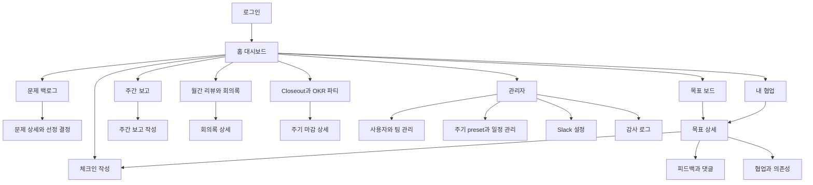
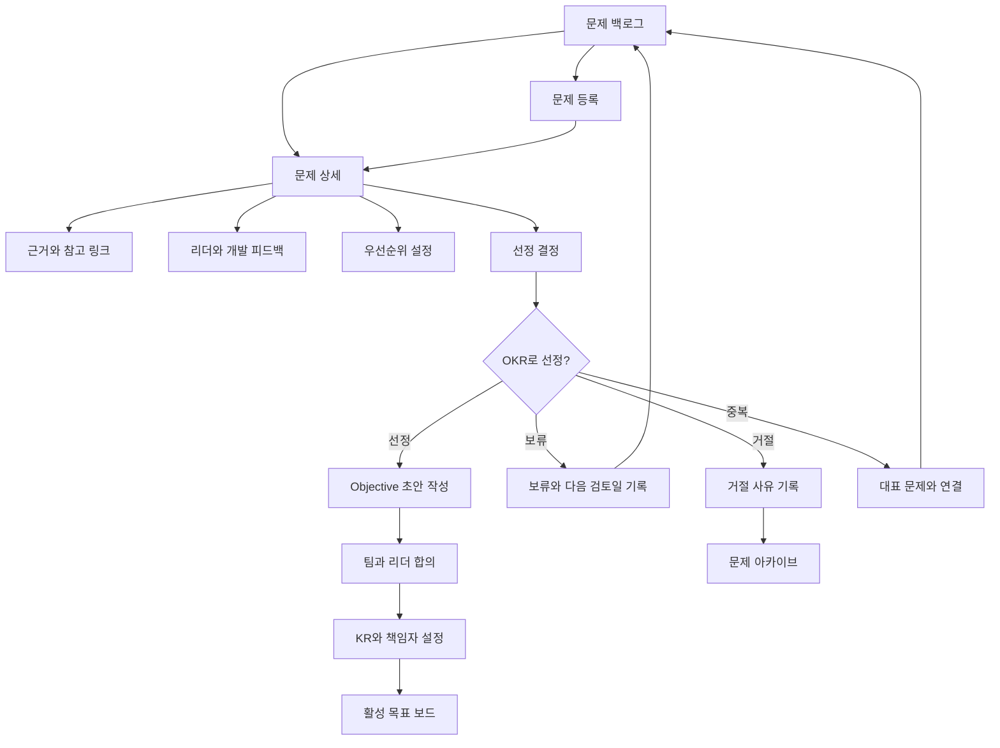
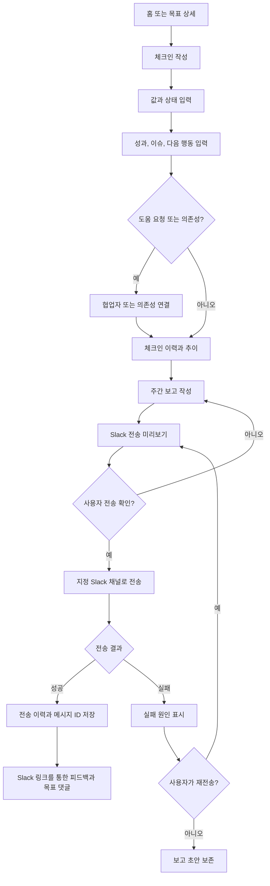
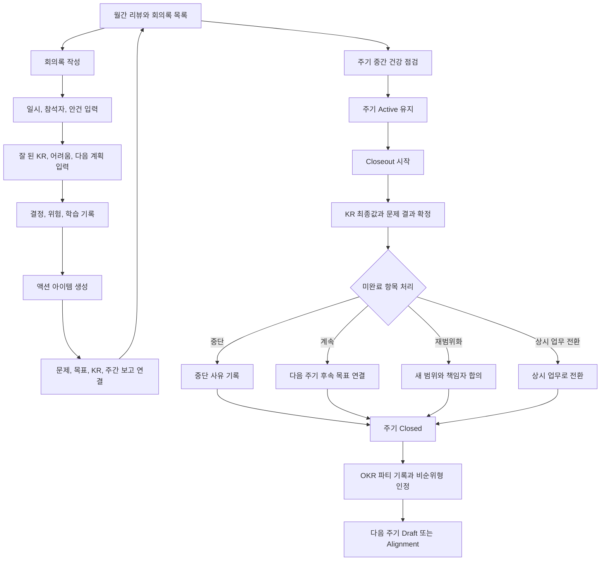
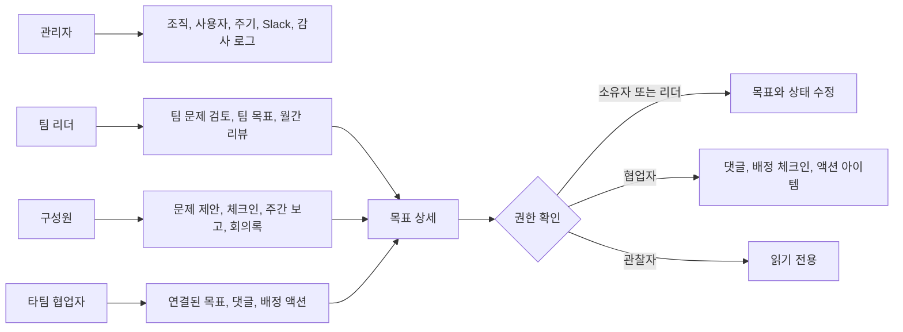

# 마크인포 문제 해결형 OKR 시스템 화면흐름도

이 문서는 [PRD](./PRD.md), [기존 MVP 기획서](./local-okr-mvp-design.md), [시장조사 종합본](../.omo/ulw-research/20260902-okr-market-research/SYNTHESIS.md)을 기준으로 MVP의 화면 이동과 핵심 운영 흐름을 정의한다.

## 1. 전체 화면 구조와 전역 이동

## 2. 문제 백로그에서 OKR 선정까지

## 3. 목표 실행·체크인·주간 Slack 보고

## 4. 월간 리뷰·회의록·closeout

## 5. 권한과 협업 화면 접근

## 화면 흐름 원칙

- 사용자는 홈에서 **내 소속 팀**, **내 책임 목표**, **협업 중인 목표**를 구분해 진입한다.
- 문제는 탐색 단계에서 목표 연결 없이 존재할 수 있으며, 선정 시점에만 Objective 또는 KR과 연결한다.
- Slack 전송은 자동 실행되지 않는다. 미리보기와 사용자의 최종 확인이 항상 필요하다.
- 체크인·주간 보고·회의록은 과거 기록을 덮어쓰지 않고 이력으로 남긴다.
- closeout 이후 원 주기는 읽기 전용이며, 이월은 새 주기 목표와의 연결로 표현한다.
- 개인 OKR은 팀별 opt-in이다. 일반 업무는 팀 KR의 책임자 또는 협업자로 표현한다.

